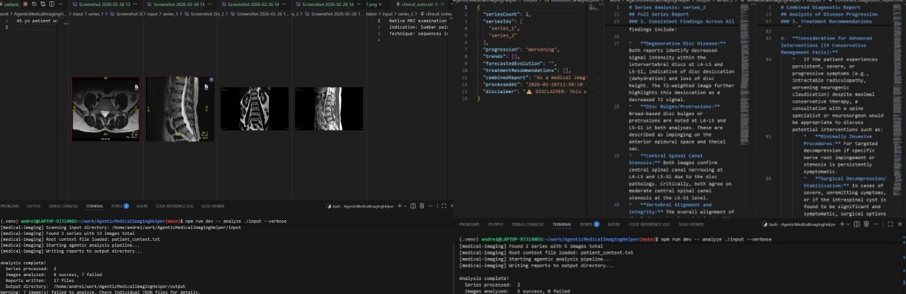

# AgenticMedicalImagingHelper

> AI-powered medical image analysis with temporal evolution tracking.
>
> First project powered by [GABBE](https://github.com/andreibesleaga/GABBE).
>
> All project generation flow documents saved in [docs](https://github.com/andreibesleaga/AgenticMedicalImagingHelper/tree/main/docs)

A local TypeScript CLI tool that uses Google Gemini AI and LangGraph.js to analyze series of medical images, detect findings, and track how conditions evolve over time across multiple imaging sessions.

⚠️ **DISCLAIMER**: This tool is for **educational and informational purposes only**. It is NOT a substitute for professional medical diagnosis or treatment. All findings must be reviewed by a qualified healthcare professional.

## Product design

See [`docs/PRODUCT.md`](./docs/PRODUCT.md) for the unified PRD / SPEC / user stories / architecture for **AgenticMedicalImagingHelper**.



---

---

## Features

- **Multi-series analysis** — processes multiple series of images (CT, MRI, X-ray, Ultrasound, etc.) in parallel
- **Fan-Out/Fan-In architecture** — LangGraph StateGraph with p-limit concurrency control
- **Temporal evolution tracking** — compares series across time and reports progression (Improving/Stable/Worsening)
- **Context integration** — reads `.txt` files alongside images for additional clinical context
- **Research grounding** — Gemini built-in Google Search for literature citations
- **Structured reports** — per-image JSON + per-series Markdown + combined evolution report

## Input Structure

```
input/
├── patient_context.txt          # Optional: overall patient context
├── series_1/                    # First imaging session
│   ├── image_001.png
│   ├── image_002.jpg
│   └── clinical_notes.txt       # Optional: series-specific context
├── series_2/                    # Second imaging session (later date)
│   ├── image_001.png
│   └── image_002.png
└── series_n/
    └── ...
```

## Output Structure

```
output/
├── series_1/
│   ├── image_001_analysis.json  # Per-image AI analysis
│   ├── image_002_analysis.json
│   └── series_summary.md        # Aggregated series report
├── series_2/
│   ├── image_001_analysis.json
│   └── series_summary.md
├── evolution_analysis.json      # Temporal comparison data
└── combined_diagnostic_report.md  # Full evolution narrative
```

## Prerequisites

- Node.js 20+
- Google Gemini API key with access to `gemini-2.5-pro`

## Installation

```bash
# Clone the repository
git clone https://github.com/andreibesleaga/AgenticMedicalImagingHelper.git
cd AgenticMedicalImagingHelper

# Install dependencies
npm install

# Copy environment template, then edit .env in your editor to set
# GOOGLE_API_KEY (and optionally GEMINI_MODEL and LOG_LEVEL).
$EDITOR .env
```

## Usage

```bash
# Build
npm run build

# Analyze images (default: ./input → ./output)
npm run dev -- analyze ./input

# With options
npm run dev -- analyze ./input ./output --concurrency 3 --verbose

# Analyze only specific series
npm run dev -- analyze ./input --series series_1 series_2

# Using the built binary
./dist/main/index.js analyze ./input --verbose
```

### CLI Options

```
analyze <inputDir> [outputDir]

Arguments:
  inputDir              Path to input directory with series sub-folders
  outputDir             Output path (default: ./output)

Options:
  -s, --series <ids...> Process only specified series IDs
  -c, --concurrency <n> Max parallel Gemini API calls (default: 5)
  -v, --verbose         Print progress to stderr
  -h, --help            Show help
      --version         Show version
```

### Exit Codes

| Code | Meaning                                             |
| ---- | --------------------------------------------------- |
| 0    | All images analyzed successfully                    |
| 1    | Missing or invalid API key                          |
| 2    | Input directory not found or unreadable             |
| 3    | No image series found in input directory            |
| 4    | Partial failure — some images could not be analyzed |
| 99   | Unexpected internal error                           |

## Environment Variables

| Variable         | Required          | Description              |
| ---------------- | ----------------- | ------------------------ |
| `GOOGLE_API_KEY` | Yes               | Google Gemini API key    |
| `GEMINI_API_KEY` | Yes (alternative) | Alternative env var name |

## Development

```bash
# Run the mocked test suite (default — 85 tests, no network)
npm test

# Same, with coverage report
npm run test:coverage

# Run the opt-in live test against the real Gemini API (6 tests, real network)
# Requires GOOGLE_API_KEY (or GEMINI_API_KEY) exported in your environment.
# Defaults GEMINI_MODEL=gemini-2.5-flash (free-tier quota); override if needed.
GOOGLE_API_KEY=... npm run test:live

# Type check
npm run typecheck

# Lint (treat warnings as errors)
npm run lint -- --max-warnings 0

# Format (prettier)
npm run format

# Build
npm run build
```

Test layout:

```
tests/
├── unit/         # Per-module unit tests (mocked)
├── e2e/          # Pipeline + CLI scenarios (mocked Gemini, real file I/O)
├── live/         # Opt-in real-API smoke (excluded from `npm test` by default)
└── fixtures/     # Synthetic PNGs, mock responses, demographic-skewed context
```

## Docker

```bash
# Build image
docker build -t medical-imaging .

# Run (mount input/output directories)
docker run --rm \
  -e GOOGLE_API_KEY=your-key \
  -v $(pwd)/input:/app/input:ro \
  -v $(pwd)/output:/app/output \
  medical-imaging analyze /app/input /app/output --verbose
```

## Architecture

```
src/
├── domain/          # Business entities, types, error classes
├── application/     # Use cases (analyze-image, aggregate-series, analyze-evolution)
├── infrastructure/  # External adapters (Gemini API, file scanner, report writer)
├── adapters/        # LangGraph StateGraph orchestrator
└── main/            # CLI entry point (Commander.js)
```

The system uses the **LangGraph Fan-Out/Fan-In** pattern:

1. `scanInputDirectory` discovers all image series
2. `analyzeImages` node fans out — analyzes all images concurrently (p-limit)
3. `aggregateSeries` node fans in — synthesizes per-series summaries
4. `analyzeEvolution` node — compares series for temporal progression
5. `writeReports` writes structured output files

## Security

- API key required via environment variable; never logged
- Path traversal protection on all file operations
- Context truncated to 2000 characters to prevent prompt injection
- Images resized to max 1024px before API submission
- All output includes mandatory medical disclaimer

See [docs/SECURITY_CHECKLIST.md](docs/SECURITY_CHECKLIST.md) for full security audit,
and [SECURITY.md](SECURITY.md) for the vulnerability-disclosure policy and Gemini
API-key handling guidance.

## Data handling & privacy

Images you provide are sent to the Google Gemini API for analysis — they leave
your machine **only** via that API call. The tool stores nothing remotely and
keeps no telemetry.

- **You must de-identify inputs.** Strip PHI / patient identifiers, including
  EXIF/DICOM metadata, **before** running. The tool does not do this for you.
- **Compliance is the operator's responsibility.** If you process real patient
  data you — not this project — are responsible for **HIPAA** (45 CFR Part 164),
  **GDPR Art. 9** (special-category health data), and local equivalents. Gemini's
  data-retention terms are governed by *your* contract with Google.
- **Cost control.** A single run can fan out to many paid Gemini calls. Set a
  hard ceiling with a Google Cloud billing quota, and optionally
  `--max-cost-usd <n>` as a client-side soft cap.

This software is **not a medical device** and must not drive clinical decisions.

## Ethics, alignment, compliance

This project treats governance under regulation as a first-class concern. The project-local artefacts behind that posture:

- [docs/COMPLIANCE.md](docs/COMPLIANCE.md) — 14-row EU AI Act article matrix + 18-row NIST AI RMF function matrix + ISO/IEEE/HIPAA cross-reference + gap roadmap + review cadence.
- [docs/architecture/decisions/](docs/architecture/decisions/) — four ADRs. **ADR-004** names seven trigger conditions (T1–T7) for migrating from single-model Gemini to a hybrid SLM router (single-model monoculture defense).
- [src/domain/fairness.ts](src/domain/fairness.ts) — allocative-harm probe: demographic-token list + diagnostic-justifier window heuristic. Exercised by [tests/e2e/fairness.test.ts](tests/e2e/fairness.test.ts) (mocked) and [tests/live/cli-full.test.ts](tests/live/cli-full.test.ts) (real Gemini output).
- Mandatory `DISCLAIMER` field on every output type, enforced at the TypeScript type level in [src/domain/types.ts](src/domain/types.ts) and asserted as a walk-the-tree hard test in Scenario 8 of [tests/e2e/full-analysis.test.ts](tests/e2e/full-analysis.test.ts).

### Verified status (2026-06-03)

| Gate                                                | Result                                                                                            |
| --------------------------------------------------- | ------------------------------------------------------------------------------------------------- |
| `npm test` (default, 16 suites of mocked tests)     | **124 / 124 pass** — coverage **97.74 % stmts · 92.79 % branches · 95.29 % funcs · 97.90 % lines** |
| `npm run test:live` (opt-in, real Gemini API)       | requires `GOOGLE_API_KEY`; skipped by default                                                     |
| `tsc --noEmit`                                       | clean                                                                                             |
| `eslint src tests`                                  | clean                                                                                             |

Skip behaviour: with no `GOOGLE_API_KEY` / `GEMINI_API_KEY` exported, the live suite passes a guard test and console-warns how to enable the real-API run. Default `npm test` excludes `tests/live/` via `testPathIgnorePatterns`.

## License

GPL v3 — see [LICENSE](LICENSE) for details.
