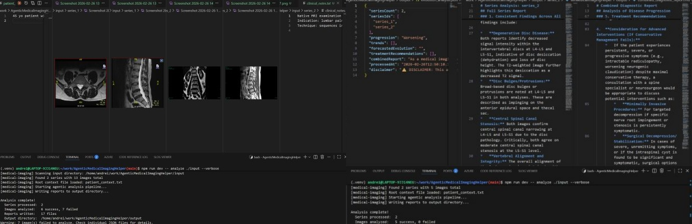

# AgenticMedicalImagingHelper

> AI-powered medical image analysis with temporal evolution tracking.
>
> First project powered by [GABBE](https://github.com/andreibesleaga/GABBE).
>
> All project generation flow documents saved in [docs](https://github.com/andreibesleaga/AgenticMedicalImagingHelper/tree/main/docs)

A local TypeScript CLI tool that uses Google Gemini AI and LangGraph.js to analyze series of medical images, detect findings, and track how conditions evolve over time across multiple imaging sessions.

⚠️ **DISCLAIMER**: This tool is for **educational and informational purposes only**. It is NOT a substitute for professional medical diagnosis or treatment. All findings must be reviewed by a qualified healthcare professional. **All outputs — findings, series summaries, temporal-evolution narratives and any treatment suggestions — are experimental model output and are NOT clinical recommendations, diagnoses, or medical advice.** This software is not a medical device, has had no clinical validation, and must never be used to make decisions about a real patient. See [`docs/COMPLIANCE.md` §0](./docs/COMPLIANCE.md) for the full scope statement.

## Product design

See [`docs/PRODUCT.md`](./docs/PRODUCT.md) for the unified PRD / SPEC / user stories / architecture for **AgenticMedicalImagingHelper**.



---

## Publications & citation

This repository is the **reference implementation** behind two publications. It is research/educational software — see [`docs/COMPLIANCE.md`](./docs/COMPLIANCE.md) for scope and regulatory positioning.

### Paper

Andrei N. Beșleagă, **"Agentic Multimodal Architectures for Medical Imaging: Orchestration, Deterministic Fairness Probing, and Governance,"** accepted at the **IEEE International Conference on Smart Innovations for Medicine and Engineering (SIME 2026)**, Sousse, Tunisia, 2–4 Nov. 2026. To appear in _IEEE Xplore_.

- Preprint DOI: [10.5281/zenodo.20762929](https://doi.org/10.5281/zenodo.20762929)

### Book

This project is featured as a reference implementation in the forthcoming Wiley book **"Agentic AI Architectures"** by Andrei Besleaga.

### BibTeX

```bibtex
@inproceedings{besleaga2026agentic,
  author    = {Be{\c{s}}leag{\u{a}}, Andrei N.},
  title     = {Agentic Multimodal Architectures for Medical Imaging:
               Orchestration, Deterministic Fairness Probing, and Governance},
  booktitle = {Proceedings of the IEEE International Conference on Smart
               Innovations for Medicine and Engineering (SIME 2026)},
  address   = {Sousse, Tunisia},
  month     = nov,
  year      = {2026},
  publisher = {IEEE},
  doi       = {10.5281/zenodo.20762929},
  note      = {to appear}
}
```

Machine-readable citation metadata is in [`CITATION.cff`](./CITATION.cff) — GitHub renders it under "Cite this repository".

### Reproducing the SIME 2026 experiments

The experiment scripts, selection manifests and result logs used for the paper live in [`experiments/sime2026/`](./experiments/sime2026/); see the README in that directory for the exact reproduction steps. The dataset is the public NIH Clinical Center **ChestX-ray14** collection (Wang et al., CVPR 2017) — de-identified frontal PA chest radiographs, used here as a 224-px derivative with no accuracy claim attached. See also [`docs/EXPERIMENTS.md`](./docs/EXPERIMENTS.md) for a short index of the individual experiments (E1–E4, payload, scanner stress).

**Research/educational software — see [docs/COMPLIANCE.md](./docs/COMPLIANCE.md) for scope and regulatory positioning.**

---

---

## Features

- **Multi-series analysis** — processes multiple series of images (CT, MRI, X-ray, Ultrasound, etc.) in parallel
- **Fan-Out/Fan-In architecture** — LangGraph StateGraph with p-limit concurrency control
- **Temporal evolution tracking** — compares series across time and reports progression (Improving/Stable/Worsening)
- **Context integration** — reads `.txt` files alongside images for additional clinical context
- **Research grounding** — Gemini built-in Google Search for literature citations
- **Structured reports** — per-image JSON + per-series Markdown + combined evolution report
- **Providers** — default **Google Gemini** (`gemini-2.5-flash`; `gemini-2.5-pro` is no longer available to new API keys). Optional **OpenRouter** second provider via `AI_PROVIDER=openrouter` + `OPENROUTER_API_KEY` + `OPENROUTER_MODEL` (default `google/gemini-2.5-flash`), which runs the unchanged pipeline on any vision-capable OpenRouter model. Note: the OpenRouter path has **no Google Search grounding**. See [ADR-006](./docs/architecture/decisions/ADR-006-openrouter-second-provider.md).

## Input Structure

```
input/
├── patient_context.txt          # Optional: overall patient context
├── series_1/                    # First imaging session
│   ├── image_001.png
│   ├── image_002.jpg
│   └── clinical_notes.txt       # Optional: series-specific context
├── series_2/                    # Second imaging session (later date)
│   ├── image_001.png
│   └── image_002.png
└── series_n/
    └── ...
```

## Output Structure

```
output/
├── series_1/
│   ├── image_001_analysis.json  # Per-image AI analysis
│   ├── image_002_analysis.json
│   └── series_summary.md        # Aggregated series report
├── series_2/
│   ├── image_001_analysis.json
│   └── series_summary.md
├── evolution_analysis.json      # Temporal comparison data
├── combined_diagnostic_report.md  # Full evolution narrative
└── run_manifest.json            # Hash-sealed audit record of the run
```

`run_manifest.json` is written on every run that reaches the model — including
the failing ones — and is described under [Governance controls](#governance-controls).

## Prerequisites

- Node.js 20+
- Google Gemini API key (default model `gemini-2.5-flash`; override with `GEMINI_MODEL`)

## Installation

```bash
# Clone the repository
git clone https://github.com/andreibesleaga/AgenticMedicalImagingHelper.git
cd AgenticMedicalImagingHelper

# Install dependencies
npm install

# Copy environment template, then edit .env in your editor to set
# GOOGLE_API_KEY (and optionally GEMINI_MODEL and LOG_LEVEL).
$EDITOR .env
```

## Usage

```bash
# Build
npm run build

# Analyze images (default: ./input → ./output)
npm run dev -- analyze ./input

# With options
npm run dev -- analyze ./input ./output --concurrency 3 --verbose

# Analyze only specific series
npm run dev -- analyze ./input --series series_1 series_2

# Using the built binary
./dist/main/index.js analyze ./input --verbose
```

### CLI Options

```
analyze <inputDir> [outputDir]

Arguments:
  inputDir              Path to input directory with series sub-folders
  outputDir             Output path (default: ./output)

Options:
  -s, --series <ids...>       Process only specified series IDs
  -c, --concurrency <n>       Max parallel Gemini API calls (default: 5)
      --max-cost-usd <n>      Abort the run once estimated cost exceeds this
                              USD figure (client-side soft cap; exit code 5)
      --manifest-chain <file> Append this run's manifest hash to an
                              append-only ledger, linked to the previous run
      --reviewer <name>       Record a human-oversight attestation in the
                              run manifest (Art. 14; no clinical effect)
      --allow-phi             Acknowledge PHI-scan findings and continue
      --strict-phi            Refuse to upload anything if the PHI scan
                              finds something (exit code 7)
  -v, --verbose               Print progress to stderr
  -h, --help                  Show help
      --version               Show version

verify-manifest <outputDir>

Arguments:
  outputDir             Output directory of the run to verify

Options:
      --chain <file>    Ledger file the run should be linked into
```

- `--concurrency <n>` bounds how many `analyzeImage` calls are in flight at
  once via `p-limit`; higher values finish faster but increase the chance of
  hitting provider rate limits (see `AI_MAX_RETRIES` below).
- `--max-cost-usd <n>` is a client-side estimate-based cap, not a substitute
  for a provider-side billing quota; see [Data handling & privacy](#data-handling--privacy).
- `--manifest-chain`, `--reviewer`, `--allow-phi`, `--strict-phi` and the
  `verify-manifest` subcommand are described under
  [Governance controls](#governance-controls).

### Exit Codes

| Code | Meaning                                                                     |
| ---- | --------------------------------------------------------------------------- |
| 0    | All images analyzed successfully                                            |
| 1    | Missing or invalid API key                                                  |
| 2    | Input directory not found or unreadable                                     |
| 3    | No image series found in input directory                                    |
| 4    | Partial failure — some images could not be analyzed                         |
| 5    | `--max-cost-usd` cap exceeded — run aborted (`CostCapExceededError`)        |
| 6    | `verify-manifest`: run manifest missing, altered, or its ledger link broken |
| 7    | `--strict-phi`: PHI/PII found in a context file — nothing was uploaded      |
| 99   | Unexpected internal error                                                   |

Code 2 also covers the input refusals added with the governance controls:
DICOM input (by extension or by magic bytes), a file over `MAX_IMAGE_BYTES`,
and a run over `MAX_IMAGES_PER_RUN`.

Codes 1, 2, 3 and 7 are pre-flight rejections: they happen before any model
call and before the output directory is created, so they leave no artefacts.
Codes 0, 4 and 5 each write a run manifest recording that exit code.

## Environment Variables

| Variable             | Required                          | Description                                                                                                                                                                    |
| -------------------- | --------------------------------- | ------------------------------------------------------------------------------------------------------------------------------------------------------------------------------ |
| `GOOGLE_API_KEY`     | Yes (Google path)                 | Google Gemini API key                                                                                                                                                          |
| `GEMINI_API_KEY`     | Yes (alternative)                 | Alternative env var name                                                                                                                                                       |
| `GEMINI_MODEL`       | No                                | Gemini model id (default `gemini-2.5-flash`)                                                                                                                                   |
| `AI_PROVIDER`        | No                                | `google` (default) or `openrouter`                                                                                                                                             |
| `OPENROUTER_API_KEY` | Yes when `AI_PROVIDER=openrouter` | OpenRouter API key                                                                                                                                                             |
| `OPENROUTER_MODEL`   | No                                | OpenRouter model id (default `google/gemini-2.5-flash`); any vision-capable model works                                                                                        |
| `AI_MAX_RETRIES`     | No                                | Max retry attempts on HTTP 429/5xx/transport errors, shared by both provider adapters (`0` disables retries); see [`src/infrastructure/retry.ts`](src/infrastructure/retry.ts) |
| `MAX_IMAGES_PER_RUN` | No                                | Hard ceiling on images accepted in one run (default `500`); exceeded ⇒ exit 2                                                                                                  |
| `MAX_IMAGE_BYTES`    | No                                | Hard ceiling on a single image file in bytes (default `52428800`, 50 MB); exceeded ⇒ exit 2                                                                                    |

See [`.env.example`](./.env.example) for the full, commented list.

## Development

```bash
# Run the mocked test suite (default, no network) — see CI or `npm test`
# for the current pass count; do not hard-code a test count here, it drifts.
npm test

# Same, with coverage report
npm run test:coverage

# Run the opt-in live test against the real Gemini API (real network)
# Requires GOOGLE_API_KEY (or GEMINI_API_KEY) exported in your environment.
# Defaults GEMINI_MODEL=gemini-2.5-flash (free-tier quota); override if needed.
GOOGLE_API_KEY=... npm run test:live

# Type check
npm run typecheck

# Lint (treat warnings as errors)
npm run lint -- --max-warnings 0

# Format (prettier)
npm run format

# Build
npm run build
```

Test layout:

```
tests/
├── unit/         # Per-module unit tests (mocked)
├── e2e/          # Pipeline + CLI scenarios (mocked Gemini, real file I/O)
├── live/         # Opt-in real-API smoke (excluded from `npm test` by default)
└── fixtures/     # Synthetic PNGs, mock responses, demographic-skewed context
```

## Docker

```bash
# Build image
docker build -t medical-imaging .

# Run (mount input/output directories)
docker run --rm \
  -e GOOGLE_API_KEY=your-key \
  -v $(pwd)/input:/app/input:ro \
  -v $(pwd)/output:/app/output \
  medical-imaging analyze /app/input /app/output --verbose
```

## Architecture

```
src/
├── domain/          # Business entities, types, error classes
├── application/     # Use cases (analyze-image, aggregate-series, analyze-evolution)
├── infrastructure/  # External adapters (Gemini API, file scanner, report writer)
├── adapters/        # LangGraph StateGraph orchestrator
└── main/            # CLI entry point (Commander.js)
```

The system uses the **LangGraph Fan-Out/Fan-In** pattern:

1. `scanInputDirectory` discovers all image series
2. `analyzeImages` node fans out — analyzes all images concurrently (p-limit)
3. `aggregateSeries` node fans in — synthesizes per-series summaries
4. `analyzeEvolution` node — compares series for temporal progression
5. `writeReports` writes structured output files

**Diagram currency.** The rendered C4 diagrams (`docs/context.png`,
`docs/components.png`, `docs/runtime.png`, embedded in
[`docs/PRODUCT.md`](docs/PRODUCT.md) §5) were generated from `docs/PLAN.md`
when the default model was `gemini-2.5-pro` and Gemini was the only provider.
They are not regenerated here. The current default model is
`gemini-2.5-flash` (`gemini-2.5-pro` is no longer available to new API keys)
with an optional OpenRouter second-provider adapter — read the diagrams as
predating [ADR-006](docs/architecture/decisions/ADR-006-openrouter-second-provider.md).

## Security

- API key required via environment variable; never logged (every provider key
  is redacted by value and by field name)
- Path traversal protection on all file operations
- DICOM input refused; per-image and per-run size limits enforced pre-upload
- Context truncated to 2000 characters to prevent prompt injection, and scanned
  for PHI/PII before the first upload
- Images re-encoded and bounded before API submission
- All output includes the mandatory medical disclaimer and a clinician-review block
- Every run leaves a hash-sealed, verifiable manifest

See [Governance controls](#governance-controls) for what each of those does.

See [docs/SECURITY_CHECKLIST.md](docs/SECURITY_CHECKLIST.md) for full security audit,
and [SECURITY.md](SECURITY.md) for the vulnerability-disclosure policy and Gemini
API-key handling guidance.

## Governance controls

The controls below exist because a research artefact that produces medical-looking
findings should be auditable by someone who was not in the room when it ran.
They are engineering controls, not a conformity assessment: the scope statement
in [docs/COMPLIANCE.md §0](docs/COMPLIANCE.md) is unchanged, and this remains an
educational research tool that is not a medical device.

- **Input validation** — path-traversal protection, an image extension
  allow-list, and hard pre-upload limits: `MAX_IMAGES_PER_RUN` (default 500) and
  `MAX_IMAGE_BYTES` (default 50 MB). All refusals, all exit code 2.
- **DICOM refusal** — `.dcm` / `.dicom` files, and any file carrying a DICOM
  Part-10 preamble whatever its extension, are refused. DICOM carries PHI in its
  tags and often burned into its pixels; converting it silently would strip
  neither. Convert to PNG/JPEG _after_ de-identifying. DICOM ingestion with
  tag-level de-identification is future work.
- **PHI/PII scan** — every context `.txt` is scanned before the first upload for
  MRN-like identifiers, SSNs, phone numbers, emails, dates of birth,
  patient-name lines and postal addresses. The default is a stderr warning plus
  a record in the run manifest; `--allow-phi` acknowledges, `--strict-phi` exits
  **7** before anything leaves the machine. Findings carry **masked** excerpts
  only (`123-45-6789` → `1**-**-****`), so the warning cannot become a second
  disclosure. It is a heuristic: a clean scan means "nothing obvious", never
  "de-identified", and it does not look inside images.
- **Mandatory disclaimer** — a required field on every output type, enforced at
  the TypeScript type level, on every JSON and Markdown artefact.
- **Clinician-review block** — every Markdown report opens with "Requires review
  by a qualified clinician before any use", before the title.
- **Cost cap** — `--max-cost-usd <n>` aborts the run (exit 5) once the
  token-based estimate crosses the cap. A client-side guard-rail, not a
  substitute for a provider-side billing quota.
- **Bounded retry** — HTTP 429/5xx and transport failures only, with exponential
  backoff and full jitter, honouring `Retry-After`; never other 4xx, never a
  validation failure. `AI_MAX_RETRIES=0` disables it.
- **Run manifest, ledger and verification** — see below.
- **Deterministic exit codes** — 0–7 and 99, documented in
  [Exit Codes](#exit-codes) and [SPEC §2.3](docs/SPEC.md).

### Run manifest and audit ledger

Every admitted run writes `<outputDir>/run_manifest.json`, sealed with a SHA-256
over the canonical JSON of its own content
([ADR-007](docs/architecture/decisions/ADR-007-run-manifest-audit-ledger.md)):

```jsonc
{
  "manifestVersion": "1.0",
  "toolVersion": "1.0.0",
  "startedAt": "2026-09-08T10:00:00.000Z",
  "finishedAt": "2026-09-08T10:01:12.481Z",
  "provider": "google",
  "model": "gemini-2.5-flash",
  "pricing": { "inputUsdPerMillion": 0.3, "outputUsdPerMillion": 2.5 },
  "settings": { "concurrency": 5, "maxCostUsd": null, "retries": 3, "imageQuality": "auto" },
  "inputDir": "/abs/path/input",
  "outputDir": "/abs/path/output",
  "inputs": [{ "path": "series_1/img_01.png", "sha256": "…", "bytes": 40213 }],
  "contextFiles": [{ "path": "series_1/context.txt", "sha256": "…", "bytes": 512 }],
  "calls": [
    {
      "index": 1,
      "stage": "image",
      "timestamp": "2026-09-08T10:00:03.117Z",
      "tokensIn": 1284,
      "tokensOut": 902,
      "estimatedUsd": 0.0026,
      "providerUsd": 0.0027,
      "retries": 0,
    },
  ],
  "outputs": [{ "path": "series_1/series_summary.md", "sha256": "…", "bytes": 2144 }],
  "totals": {
    "calls": 4,
    "tokensIn": 5136,
    "tokensOut": 3608,
    "estimatedUsd": 0.0105,
    "providerUsd": 0.0108,
    "images": 2,
    "imagesSucceeded": 2,
    "imagesFailed": 0,
    "series": 1,
  },
  "exitCode": 0,
  "warnings": [],
  "humanReview": { "required": true, "reviewedBy": null },
  "prevManifestHash": null,
  "manifestHash": "9f3c…", // SHA-256 over the canonical JSON of everything above
}
```

`tokensOut` includes the model's thinking tokens, because that is how they are
billed. `providerUsd` appears only when the provider reports its own charge
(OpenRouter does; the Gemini SDK does not). `stage` is `image`, `series` or
`evolution`.

```bash
# Link each run into an append-only ledger and attest who reviewed it
medical-imaging analyze ./input ./output \
  --manifest-chain ./audit/chain.jsonl \
  --reviewer "Dr A. Reviewer"

# Re-hash the run and check its ledger link — exit 0 ok, 6 tampered/missing
medical-imaging verify-manifest ./output --chain ./audit/chain.jsonl
```

`verify-manifest` re-computes the manifest hash, re-hashes every input and
output file still on disk, and validates the chain link, printing PASS / FAIL /
SKIP per check. Files that no longer exist are reported as skipped rather than
failed — inputs live outside the tool's control — while a _changed_ file fails.

**Honest limit.** This is tamper-**evidence**, not tamper-**proofing**. The
ledger sits on the same disk as the manifests it seals, so a local attacker with
write access who rewrites a manifest _and_ every subsequent ledger entry leaves
no trace ([THREAT_MODEL T9](docs/architecture/THREAT_MODEL.md)). Signing over an
off-box key, or an external timestamping log, is the upgrade path and is
deliberately not claimed here. Keep the ledger on separate append-only storage
if you need more.

## Data handling & privacy

Images you provide are sent to the Google Gemini API for analysis — they leave
your machine **only** via that API call. The tool stores nothing remotely and
keeps no telemetry.

- **You must de-identify inputs.** Strip PHI / patient identifiers, including
  EXIF/DICOM metadata, **before** running. The tool does not do this for you.
- **Compliance is the operator's responsibility.** If you process real patient
  data you — not this project — are responsible for **HIPAA** (45 CFR Part 164),
  **GDPR Art. 9** (special-category health data), and local equivalents. Gemini's
  data-retention terms are governed by _your_ contract with Google.
- **Cost control.** A single run can fan out to many paid Gemini calls. Set a
  hard ceiling with a Google Cloud billing quota, and optionally
  `--max-cost-usd <n>` as a client-side soft cap.

This software is **not a medical device** and must not drive clinical decisions.

## Ethics, alignment, compliance

This project treats governance under regulation as a first-class concern. The project-local artefacts behind that posture:

- [docs/COMPLIANCE.md](docs/COMPLIANCE.md) — 14-row EU AI Act article matrix + 18-row NIST AI RMF function matrix + ISO/IEEE/HIPAA cross-reference + gap roadmap + review cadence.
- [docs/architecture/decisions/](docs/architecture/decisions/) — seven ADRs (ADR-001…007). **ADR-004** names seven trigger conditions (T1–T7) for migrating from single-model Gemini to a hybrid SLM router (single-model monoculture defense); **ADR-006** records the OpenRouter second-provider adapter added when trigger T1 fired (the default Gemini model was retired for new API keys, September 2026); **ADR-007** records the per-run manifest and hash-chained audit ledger that closes the Art. 12 / MANAGE 4.1 gaps, together with the PHI pre-flight and the input refusals.
- [src/domain/fairness.ts](src/domain/fairness.ts) — allocative-harm probe: demographic-token list + diagnostic-justifier window heuristic. Exercised by [tests/e2e/fairness.test.ts](tests/e2e/fairness.test.ts) (mocked) and [tests/live/cli-full.test.ts](tests/live/cli-full.test.ts) (real Gemini output).
- Mandatory `DISCLAIMER` field on every output type, enforced at the TypeScript type level in [src/domain/types.ts](src/domain/types.ts) and asserted as a walk-the-tree hard test in Scenario 8 of [tests/e2e/full-analysis.test.ts](tests/e2e/full-analysis.test.ts).

### Verified status (2026-09-08)

| Gate                                            | Result                                                                                            |
| ----------------------------------------------- | ------------------------------------------------------------------------------------------------- |
| `npm test` (default, 19 suites of mocked tests) | **199 / 199 pass** — coverage **98.13 % stmts · 96.41 % branches · 95.72 % funcs · 98.6 % lines** |
| `npm run test:live` (opt-in, real Gemini API)   | requires `GOOGLE_API_KEY`; skipped by default                                                     |
| `tsc --noEmit`                                  | clean                                                                                             |
| `eslint src tests`                              | clean                                                                                             |

These numbers are a point-in-time snapshot; run `npm test` / `npm run
test:coverage` for the current figures rather than trusting this table as
tests are added. Skip behaviour: with no `GOOGLE_API_KEY` / `GEMINI_API_KEY`
exported, the live suite passes a guard test and console-warns how to enable
the real-API run. Default `npm test` excludes `tests/live/` via
`testPathIgnorePatterns`.

## License

GPL v3 — see [LICENSE](LICENSE) for details.
