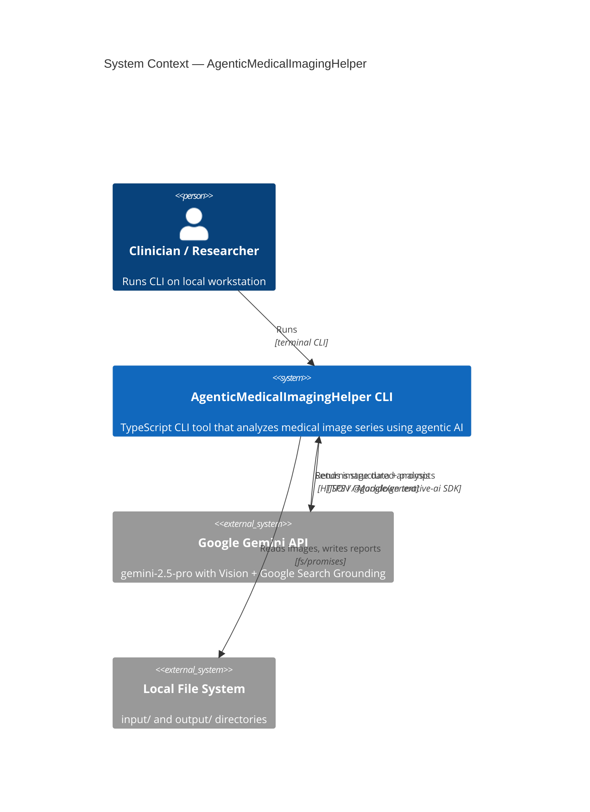
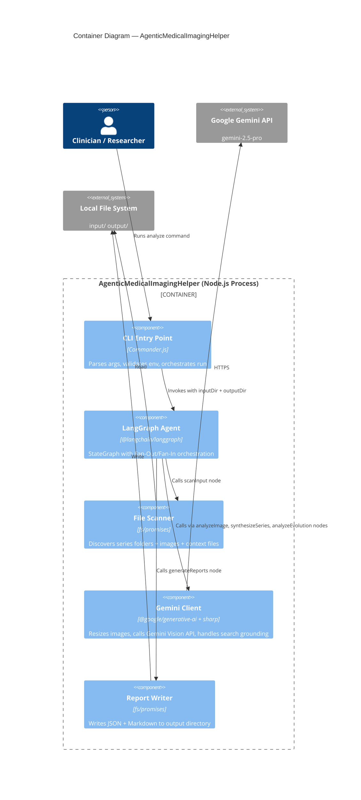
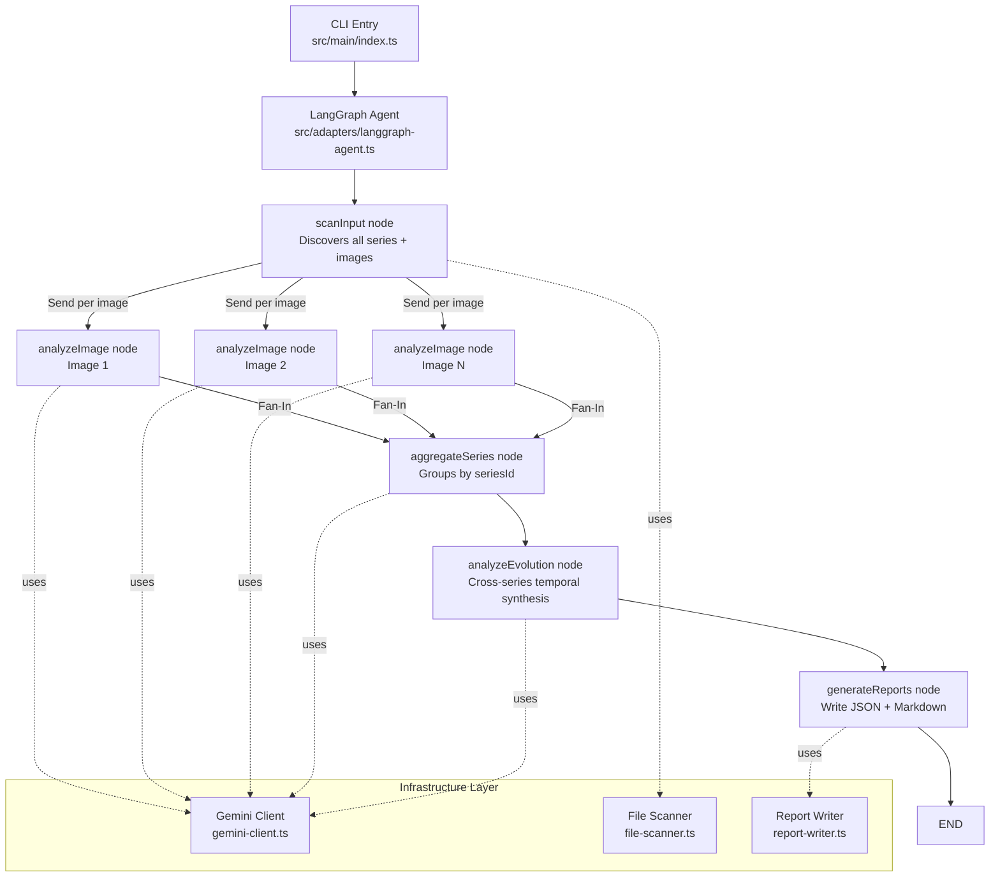

# PLAN.md: AgenticMedicalImagingHelper — Architecture & Design

<!-- Created by: arch-design.skill | Phase: S02 | Date: 2026-02-25 -->
<!-- Status: PENDING HUMAN APPROVAL before proceeding to S03 Specification -->
<!-- References: docs/PRD.md, docs/strategic/BUSINESS_CASE.md -->

---

## 1. System Context (C4 Level 1)



---

## 2. Container Diagram (C4 Level 2)



---

## 3. Component Diagram (C4 Level 3) — LangGraph Agent Internals



---

## 4. Clean Architecture Layer Map

```
src/domain/           <- Business entities, types, domain errors
                         MUST NOT import from: any other layer

src/application/      <- Use cases (pure business logic)
                         MUST NOT import from: infrastructure, adapters
                         CAN import from: domain

src/infrastructure/   <- External: Gemini API client, fs scanner, report writer
                         CAN import from: domain
                         MUST NOT import from: application, adapters

src/adapters/         <- LangGraph agent (orchestration/wiring)
                         CAN import from: application, infrastructure, domain
                         MUST NOT import from: main

src/main/             <- Composition root: Commander CLI
                         CAN import from: all layers
```

---

## 5. Fan-Out / Fan-In Data Flow

### Phase 1 — Scan Input

```
scanInput node:
  Input:  { inputDir: "./input" }
  Action: fs.readdir(inputDir) → find series folders
          For each series: find *.png|*.jpg|*.jpeg → imagePaths[]
          Find *.txt → textContextPath?
  Output: GraphState.series = SeriesInfo[]
  Next:   Emit Send("analyzeImage", { imagePath, seriesId }) × N
```

### Phase 2 — Fan-Out: analyzeImage (parallel, up to MAX_CONCURRENCY)

```
analyzeImage node (runs N times in parallel):
  Input:  { imagePath: string, seriesId: string }
  Action: sharp(imagePath).resize(1024) → base64 PNG
          geminiClient.analyzeImage(base64, prompt) → rawResponse
          Parse structured fields from response
  Output: ImageAnalysis object → appended to GraphState.imageResults[]
```

### Phase 3 — Fan-In: aggregateSeries

```
aggregateSeries node (runs once after all analyzeImage complete):
  Input:  GraphState.imageResults[] + GraphState.series[].textContextPath
  Action: Group imageResults by seriesId
          For each series: call geminiClient.synthesizeSeries(analyses, textContext)
  Output: SeriesSummary[] → GraphState.seriesResults[]
```

### Phase 4 — analyzeEvolution

```
analyzeEvolution node:
  Input:  GraphState.seriesResults[]
  Action: If seriesCount > 1: call geminiClient.analyzeEvolution(seriesSummaries)
          If seriesCount = 1: generate single-series report (no temporal comparison)
  Output: TemporalAnalysis → GraphState.evolutionResult
```

### Phase 5 — generateReports

```
generateReports node:
  Input:  GraphState.imageResults[], seriesResults[], evolutionResult
  Action: For each image: write output/<seriesId>/<image>_analysis.json
          For each series: write output/<seriesId>/series_summary.md
          Write output/evolution_analysis.json
          Write output/combined_diagnostic_report.md
  Output: { success: true, reportPaths: string[] }
```

---

## 6. Concurrency Model

- `p-limit(MAX_CONCURRENCY)` wraps each `analyzeImage` call (default: 5)
- LangGraph `Send` API dispatches all image tasks simultaneously; `p-limit` throttles actual API calls
- Series aggregation runs after ALL images complete (sequential fan-in)
- Evolution analysis runs after ALL series aggregations complete
- No shared mutable state between analyzeImage instances (pure function per image)

---

## 7. Gemini Prompt Templates

### Template 1: Per-Image Analysis

```
You are a highly skilled medical imaging expert with extensive knowledge in radiology and diagnostic imaging.
Analyze this medical image and structure your response as follows:

### 1. Image Type & Region
- Imaging modality (X-ray/MRI/CT/Ultrasound/Other)
- Anatomical region and patient positioning
- Image quality and technical adequacy

### 2. Key Findings
- Primary observations (systematic listing)
- Abnormalities with precise descriptions (location, size, shape, density)
- Severity rating: Normal / Mild / Moderate / Severe

### 3. Diagnostic Assessment
- Primary diagnosis with confidence level (%)
- Differential diagnoses in order of likelihood
- Evidence from image supporting each diagnosis
- Critical or urgent findings (if any)

### 4. Patient-Friendly Explanation
- Simple language summary of findings
- Visual analogies if helpful
- Common patient concerns addressed

### 5. Research Context
Use Google Search to find:
- Recent medical literature on similar findings
- Standard treatment protocols
- Relevant medical links (2-3 key references)

DISCLAIMER: This analysis is AI-generated for educational purposes only.
Do not make clinical decisions based solely on this output.
```

### Template 2: Per-Series Synthesis

```
You are a medical imaging specialist synthesizing findings from {imageCount} images of the same series.

Individual image analyses:
{imageAnalyses}

{contextSection}  <!-- WHEN context.txt exists: <context>{textContent}</context> -->

Provide:
1. Consistent findings across all images
2. Discrepancies between views (and possible explanations)
3. Primary diagnosis with confidence
4. Differential diagnoses
5. Series-level clinical summary

DISCLAIMER: AI-generated for educational purposes only.
```

### Template 3: Temporal Evolution (Cross-Series)

```
You are a medical imaging specialist analyzing disease progression across {seriesCount} imaging sessions.

Series summaries (ordered chronologically by folder name):
{seriesSummaries}

Analyze:
1. Changes between sessions (improving / stable / worsening per finding)
2. Overall progression trend
3. Key inflection points
4. Forecasted evolution without treatment
5. Treatment recommendations based on observed trends

DISCLAIMER: AI-generated for educational purposes only. Professional clinical review required.
```

---

## 8. Output File Structure

```
output/
├── series_1/                           <- Mirrors input/series_1/
│   ├── image_001_analysis.json
│   ├── image_002_analysis.json
│   └── series_summary.md
├── series_2/
│   ├── image_001_analysis.json
│   └── series_summary.md
├── evolution_analysis.json             <- Structured temporal data
└── combined_diagnostic_report.md      <- Full human-readable report
```

---

## 9. Error Handling Strategy

| Error | Action | Exit Code |
|---|---|---|
| `GOOGLE_API_KEY` not set | Log error + exit | 1 |
| Input directory not found | Log error + exit | 1 |
| No images found in input | Log warning + exit | 1 |
| Single image API failure | Log error, set `status: "error"` in JSON, continue | — (no exit) |
| All images in series fail | Log error, skip series aggregation | — (no exit) |
| Unrecoverable LangGraph error | Log error + exit | 2 |

---

## 10. Architecture Decision Records (ADRs)

See:
- [ADR-001: LangGraph.js for orchestration](architecture/decisions/ADR-001-langgraph-orchestration.md)
- [ADR-002: Gemini Google Search Grounding](architecture/decisions/ADR-002-gemini-search-grounding.md)
- [ADR-003: sharp for image preprocessing](architecture/decisions/ADR-003-image-preprocessing.md)

---

## 11. Threat Model Reference

See: [docs/architecture/THREAT_MODEL.md](architecture/THREAT_MODEL.md)

---

## 12. Approval

| Role | Name | Status | Date |
|---|---|---|---|
| Product | Human (project owner) | **PENDING** | — |
| Engineering | Claude Code | APPROVED | 2026-02-25 |
| Security | Claude Code | APPROVED (threat model embedded) | 2026-02-25 |

**Human approval required before proceeding to S03 Specification.**

---

*Created by: Claude Code (arch-design.skill) | 2026-02-25*
*GABBE SDLC Phase: S02 — Design*
