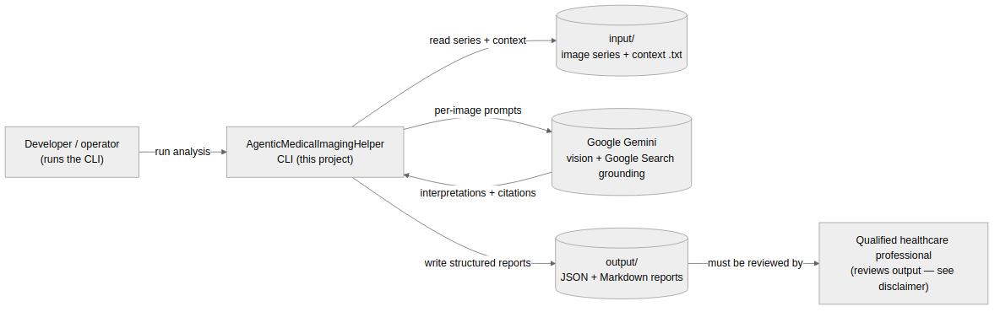
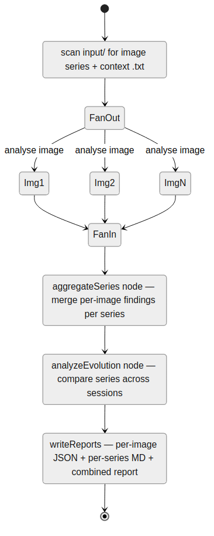
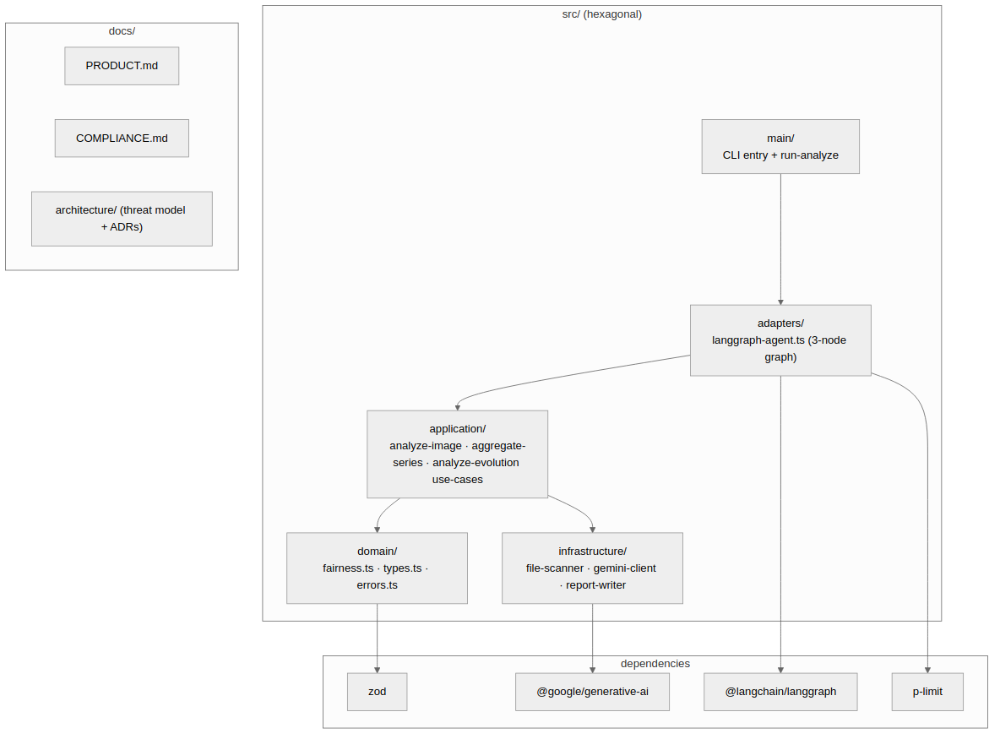

# Agentic Medical Imaging Helper — Product Design (Summary Index)

> Documentation index for this project. It keeps a full documentation set (`PRD.md`, `SPEC.md`, `COMPLIANCE.md`, `architecture/`, `strategic/`) — PRODUCT.md points at those artefacts and gives the unified summary. Where this summary and the detailed docs disagree, **the code and `README.md` are authoritative**.

## 1. Summary

A local TypeScript **CLI** medical-imaging analysis tool powered by Google Gemini, using a LangGraph.js **fan-out / fan-in** `StateGraph` to analyse multiple imaging series (CT / MRI / X-ray / ultrasound) in parallel and track how findings evolve across imaging sessions. Output is a set of structured reports — per-image JSON, per-series Markdown, and a combined evolution report. It is built as a worked example of ethically-deployed, regulated AI: it ships an explicit EU AI Act / NIST AI RMF compliance cross-walk (`docs/COMPLIANCE.md`) and an architectural-decision record set, and it carries a prominent "not a medical device" disclaimer.

## 2. PRD — see existing PRD.md

The canonical PRD lives at [`docs/PRD.md`](./PRD.md).

- **Audience.** Engineers studying how an agentic imaging workflow is documented and reasoned about under EU AI Act / FDA SaMD framing.
- **Problem.** Multi-modality cases need parallel sub-analyses then a structured merge and a temporal comparison; doing this as one monolithic prompt is neither parallel nor auditable.
- **Goal.** Parallel fan-out over images → fan-in per series → temporal evolution analysis → structured report files on disk.
- **Non-goals.** Replacing the radiologist; autonomous diagnosis; acting as a medical device (see the README disclaimer).
- **Acceptance criteria.** See `PRD.md` (success metrics) and `COMPLIANCE.md` (regulatory cross-walks).

## 3. SPEC — see existing SPEC.md

The functional + non-functional spec is in [`docs/SPEC.md`](./SPEC.md). Key surfaces, as actually built:

- LangGraph `StateGraph` with three nodes: `analyzeImages` (fan-out, `p-limit` concurrency) → `aggregateSeries` (fan-in per series) → `analyzeEvolution` (temporal comparison) — `src/adapters/langgraph-agent.ts`.
- Strict TypeScript, ESM, Jest tests, CLI entry under `src/main/`.
- Fairness logic: `src/domain/fairness.ts` (domain module).
- Compliance documentation: [`docs/COMPLIANCE.md`](./COMPLIANCE.md) — EU AI Act / NIST AI RMF / ISO cross-walks and gap roadmap.
- Architecture decisions: [`docs/architecture/`](./architecture/) — threat model + four ADRs (ADR-004 covers the single-model monoculture risk).

## 4. User Stories

1. *As a clinician-developer, I want each image analysed in parallel so that multi-series cases don't serialise into long latency.*
   - Given a case with several series, when the graph runs `analyzeImages`, all images are analysed concurrently under a `p-limit` cap and merged per series in `aggregateSeries`.

2. *As a clinician-developer, I want temporal evolution surfaced so that progression across sessions is explicit.*
   - Given series from different dates, when `analyzeEvolution` runs, it reports each finding as Improving / Stable / Worsening in the combined evolution report.

3. *As a reviewer, I want every output to be a plain inspectable file so that a qualified professional can review it before any clinical use.*
   - Given a completed run, the tool writes per-image JSON, per-series Markdown, and a combined report under `output/`; nothing is auto-actioned — the README disclaimer makes human review mandatory.

4. *As a compliance reader, I want the regulatory posture written down so that the project can be assessed against the EU AI Act.*
   - Given `docs/COMPLIANCE.md`, the EU AI Act article matrix and NIST AI RMF cross-walk document where the project meets, partially meets, or defers each requirement.

## 5. Architecture

**Context.**

**Runtime — fan-out, fan-in, evolution.**

**Components.**

For the threat model and ADRs see [`docs/architecture/`](./architecture/).

## 6. Implementation Map

| Capability | Implementation |
| ---------- | -------------- |
| Fan-out / fan-in | `analyzeImages` → `aggregateSeries` nodes in `src/adapters/langgraph-agent.ts` |
| Temporal evolution analysis | `analyzeEvolution` node + `src/application/analyze-evolution.use-case.ts` |
| EU AI Act Annex III framing | `docs/COMPLIANCE.md` cross-walk |
| Single-model monoculture risk | `docs/architecture/decisions/ADR-004-single-model-monoculture-risk.md` |
| Fairness logic | `src/domain/fairness.ts` |

## 7. Summary

This project is an **ethical-deployment exemplar**: a real LangGraph application whose repo artefacts (compliance cross-walk, ADRs, threat model) make its governance posture inspectable. It is intentionally larger than most example projects because it treats *governance under regulation* as a first-class concern.

> **Note:** HITL sign-off and a hash-chained audit trail are discussed in `COMPLIANCE.md` as part of the regulatory *target state*; they are not implemented in the current three-node graph. Keep PRODUCT.md describing what the code does today.

## 8. References

- Code: `src/main/` (CLI entry), `src/adapters/langgraph-agent.ts` (the three-node graph), `src/application/` (per-image / per-series / evolution use-cases), `src/domain/` (`fairness.ts`, types), `src/infrastructure/` (Gemini client, file scanner, report writer).
- Docs: [`PRD.md`](./PRD.md), [`SPEC.md`](./SPEC.md), [`COMPLIANCE.md`](./COMPLIANCE.md), [`PLAN.md`](./PLAN.md), [`SECURITY_CHECKLIST.md`](./SECURITY_CHECKLIST.md), [`BOOTSTRAP_MISSION.md`](./BOOTSTRAP_MISSION.md), `architecture/`, `strategic/`.
