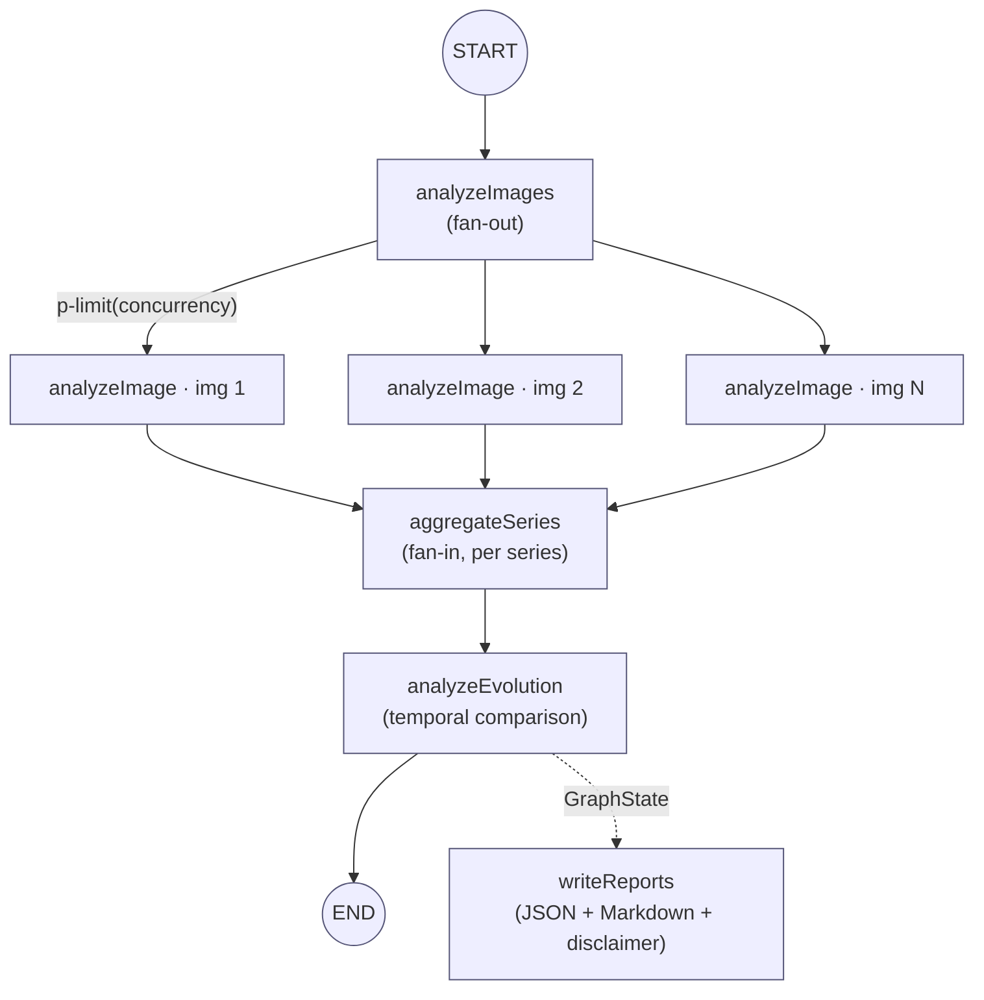

# Architecture

`AgenticMedicalImagingHelper` is a local CLI that orchestrates Google Gemini
through a LangGraph.js `StateGraph` using a **fan-out / fan-in** topology.

## StateGraph topology

## Nodes

| Node | Responsibility | Source |
| ---- | -------------- | ------ |
| `analyzeImages` | Fans out every `(imagePath, seriesId)` pair and analyses each image concurrently, bounded by `p-limit(concurrency)`. Results accumulate via an append reducer. | `src/adapters/langgraph-agent.ts` |
| `aggregateSeries` | Fans in per series: synthesises consistent findings, discrepancies, primary/differential diagnoses. | `src/adapters/langgraph-agent.ts` → `src/application/aggregate-series.use-case.ts` |
| `analyzeEvolution` | Compares series across time and classifies progression (`Improving` / `Stable` / `Worsening` / `Inconclusive` / `SingleSeries`). | `src/application/analyze-evolution.use-case.ts` |
| `writeReports` | Writes per-image JSON, per-series Markdown, and the combined evolution report — each carrying the mandatory disclaimer. | `src/infrastructure/report-writer.ts` |

## Layering (ports & adapters)

- `domain/` — pure types, errors, fairness probe (no I/O).
- `application/` — use-cases (orchestration only).
- `infrastructure/` — Gemini client, file scanner, report writer, cost meter (outside-world adapters).
- `adapters/` — LangGraph wiring (`langgraph-agent.ts`).
- `main/` — CLI composition root (`index.ts`) + handler (`run-analyze.ts`).

The framework (LangGraph) is quarantined to `adapters/`; swapping orchestration
would not touch the domain or application layers.

## Cross-cutting

- **Cost guard** — `infrastructure/cost-meter.ts` records real token usage from
  the Gemini SDK response and optionally aborts on `--max-cost-usd`.
- **Disclaimer** — a required field on every output type, enforced at the type
  level (`domain/types.ts`) and asserted in `tests/e2e/full-analysis.test.ts`.
- See [architecture/decisions/](architecture/decisions/) for ADRs and
  [architecture/THREAT_MODEL.md](architecture/THREAT_MODEL.md).
