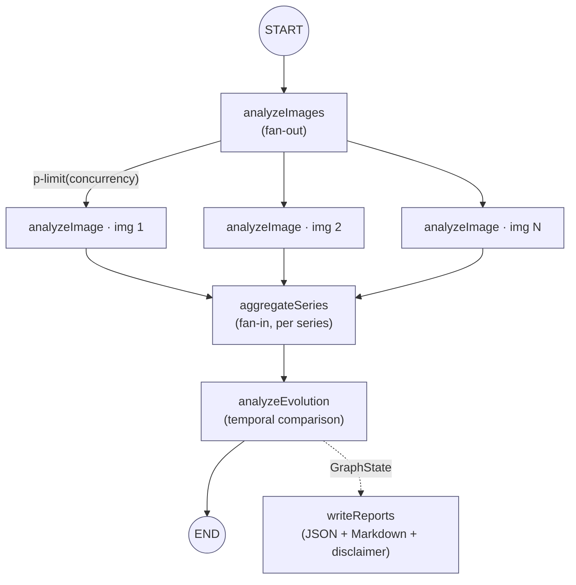

# Architecture

`AgenticMedicalImagingHelper` is a local CLI that orchestrates Google Gemini
through a LangGraph.js `StateGraph` using a **fan-out / fan-in** topology.

## StateGraph topology

```mermaid
graph TD
    START((START)) --> A["analyzeImages<br/>(fan-out)"]
    A -->|"p-limit(concurrency)"| A1["analyzeImage · img 1"]
    A --> A2["analyzeImage · img 2"]
    A --> An["analyzeImage · img N"]
    A1 --> B
    A2 --> B
    An --> B["aggregateSeries<br/>(fan-in, per series)"]
    B --> C["analyzeEvolution<br/>(temporal comparison)"]
    C --> END((END))
    C -.->|"GraphState"| W["writeReports<br/>(JSON + Markdown + disclaimer)"]

    classDef node fill:#eef,stroke:#557;
    class A,B,C node;
```

## Nodes

| Node               | Responsibility                                                                                                                                                 | Source                                                                             |
| ------------------ | -------------------------------------------------------------------------------------------------------------------------------------------------------------- | ---------------------------------------------------------------------------------- |
| `analyzeImages`    | Fans out every `(imagePath, seriesId)` pair and analyses each image concurrently, bounded by `p-limit(concurrency)`. Results accumulate via an append reducer. | `src/adapters/langgraph-agent.ts`                                                  |
| `aggregateSeries`  | Fans in per series: synthesises consistent findings, discrepancies, primary/differential diagnoses.                                                            | `src/adapters/langgraph-agent.ts` → `src/application/aggregate-series.use-case.ts` |
| `analyzeEvolution` | Compares series across time and classifies progression (`Improving` / `Stable` / `Worsening` / `Inconclusive` / `SingleSeries`).                               | `src/application/analyze-evolution.use-case.ts`                                    |
| `writeReports`     | Writes per-image JSON, per-series Markdown, and the combined evolution report — each carrying the mandatory disclaimer.                                        | `src/infrastructure/report-writer.ts`                                              |

## Layering (ports & adapters)

- `domain/` — pure types, errors, fairness probe (no I/O).
- `application/` — use-cases (orchestration only).
- `infrastructure/` — Gemini client, OpenRouter client, file scanner, report writer, cost meter (outside-world adapters).
- `adapters/` — LangGraph wiring (`langgraph-agent.ts`).
- `main/` — CLI composition root (`index.ts`) + handler (`run-analyze.ts`).

The framework (LangGraph) is quarantined to `adapters/`; swapping orchestration
would not touch the domain or application layers.

## Model providers

The graph talks to the model only through the `GeminiClient` port
(`analyzeImage` / `synthesizeSeries` / `analyzeEvolution`). Two adapters
implement it: Google Gemini via the official SDK (default, `AI_PROVIDER=google`)
and **OpenRouter** (`AI_PROVIDER=openrouter`, `infrastructure/openrouter-client.ts`),
an OpenAI-compatible `chat/completions` shim that satisfies the same
`generateContent` surface, so prompts, parsers, error handling and the LangGraph
wiring are shared verbatim and any OpenRouter vision model can be run from the
unchanged CLI. Differences are deliberate and documented in
[ADR-006](architecture/decisions/ADR-006-openrouter-second-provider.md): the
OpenRouter path has **no Google Search grounding** (ADR-002 is Gemini-only; the
"Research Context" section is answered from model knowledge alone), it sends no
JSON-mode flag because the pipeline consumes Markdown, and it forwards the
provider's own `usage.cost` (USD) to the cost meter as `providerReportedUsd`
next to the token-based estimate. Gemini remains the default; OpenRouter exists
to test the single-model monoculture risk tracked in ADR-004.

## Cross-cutting

- **Cost guard** — `infrastructure/cost-meter.ts` records real token usage from
  the provider response and optionally aborts on `--max-cost-usd`; when the
  provider reports an authoritative per-call charge (OpenRouter) it is summed
  as `providerReportedUsd` alongside the estimate.
- **Disclaimer** — a required field on every output type, enforced at the type
  level (`domain/types.ts`) and asserted in `tests/e2e/full-analysis.test.ts`.
- **Retry / backoff** — `infrastructure/retry.ts:withRetry` wraps both provider
  adapters with bounded exponential backoff and full jitter. Only HTTP 429/5xx
  and transport-level failures are retried (never other 4xx, never a parse or
  Zod-validation failure); `Retry-After` / provider `RetryInfo` is honoured
  when present; attempt count is configurable via `AI_MAX_RETRIES` (`0`
  disables retries). The cost meter records a failed attempt's usage once, not
  once per retry. See [ADR-006](architecture/decisions/ADR-006-openrouter-second-provider.md#update-2026-09-08).
- **Structured-output validation** — model responses are parsed to Markdown
  fields at all three pipeline stages (`analyzeImage`, `aggregateSeries` /
  `synthesizeSeries`, `analyzeEvolution`) and then checked against a Zod
  schema (`domain/types.ts`). A schema failure is recorded in a `validation`
  field on the corresponding output rather than aborting the run, and the
  free-text fields extracted by the Markdown parser are still returned, so a
  validation failure degrades to free text instead of failing the pipeline.
- **Exit codes** — `main/index.ts` / `main/run-analyze.ts` return one of:
  `0` all series processed (even if individual images failed), `1` user error
  (missing/invalid API key, bad `--max-cost-usd` value, unknown `AI_PROVIDER`),
  `2` input directory not found or unreadable, `3` no image series found,
  `4` partial failure (some images could not be analyzed), `5` the
  `--max-cost-usd` cap was exceeded and the run was aborted
  (`CostCapExceededError`), `6` `verify-manifest` found the run manifest
  missing, altered or unlinked, `7` `--strict-phi` found a likely identifier in
  a context file and refused to upload, `99` unexpected internal error. See
  [SPEC.md §2.3](SPEC.md#23-exit-codes) and the README [Exit Codes](../README.md#exit-codes)
  table.
- **Run manifest and audit ledger** — every admitted run writes a
  `run_manifest.json` into its output directory, sealed with a SHA-256 over the
  canonical JSON of its own content
  ([ADR-007](architecture/decisions/ADR-007-run-manifest-audit-ledger.md),
  `infrastructure/run-manifest.ts`). It records provider and model, the pricing
  and settings in force, the SHA-256 and byte length of every input image and
  context file, one row per model call (stage, timestamp, tokens in/out
  including thinking tokens, per-call USD, provider-reported USD, retries), the
  SHA-256 of every artefact written, run totals, the exit code, the run's
  warnings, and the `humanReview` record. The per-call rows come from the
  existing cost-meter `onCall` hook plus `withStageTracking`, a pass-through
  wrapper around the `GeminiClient` port that labels the ledger at each node
  boundary — so no adapter, use-case or graph node changed to gain the record.
  `--manifest-chain <file>` links each run to the previous run's hash in an
  append-only JSON-Lines ledger, and `medical-imaging verify-manifest
<outputDir> [--chain <file>]` re-checks all of it offline (exit 6 on failure).
  The manifest is written on every exit path from the point the run is admitted
  — including the failing ones — as a best-effort side effect that can never
  change the exit code; pre-flight rejections (1, 2, 3, 7) deliberately leave
  nothing behind. This is tamper-_evidence_, not tamper-proofing: see
  THREAT_MODEL **T9** for the residual local-write risk.
- **PHI pre-flight** — `domain/phi-scan.ts` scans context files for likely
  identifiers before the first upload; findings carry masked excerpts only and
  land on stderr and in the manifest's `warnings[]`, with `--strict-phi`
  turning them into a refusal (THREAT_MODEL **T10**).
- See [architecture/decisions/](architecture/decisions/) for ADRs and
  [architecture/THREAT_MODEL.md](architecture/THREAT_MODEL.md).
