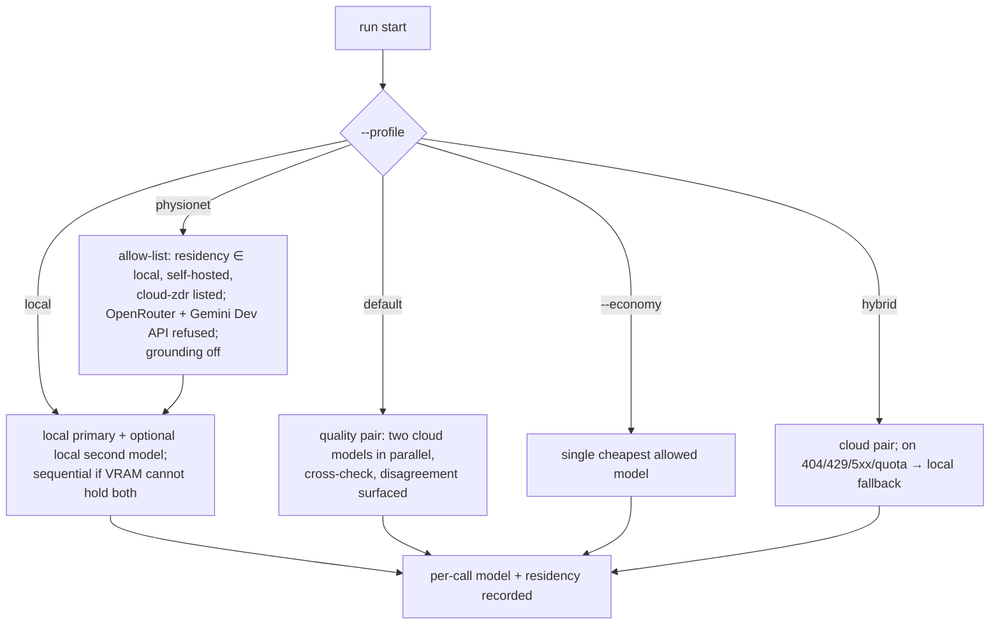
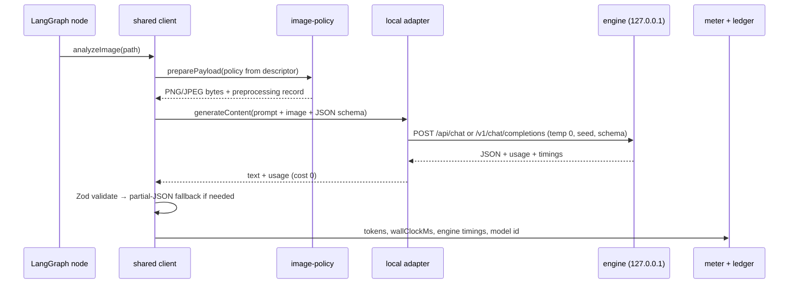

# Local and self-hosted inference: research, architecture and plan

**Status.** Plan only, written 2026-09-29. No code is changed by this document. Every version, size
and behaviour below was read from the cited page on 2026-09-29; anything not confirmed from a
primary source is marked **UNVERIFIED**. Re-check each row on the day the matching work item
starts.

**Scope reminder.** Research software, not a medical device. Running a model locally changes where
data is processed. It does not change the intended purpose, the mandatory clinician review, or
anything in [`../COMPLIANCE.md`](../COMPLIANCE.md).

---

## 1. Purpose and scope

The roadmap already commits to an on-device adapter ([`../ROADMAP.md`](../ROADMAP.md) §2.2 C5,
§7 decision 5, §8.1) and to a router ([`../ROADMAP.md`](../ROADMAP.md) §2.1 P4, §7 decision 4). §10.2
turns local inference from an option into a requirement. PhysioNet credentialed data may be
processed only by local models or by an enterprise cloud configured for zero retention, because
PhysioNet's policy states that "MIMIC data must not be stored or retained by third-party LLM
services" and advises researchers to "use locally deployed LLMs"
([PhysioNet, 2025-09-24](https://physionet.org/news/post/llm-responsible-use)).

This document specifies:

- how local engines (Ollama, vLLM, llama.cpp and others) fit behind the existing provider port;
- what the router, image policy, cost meter, run manifest, `--profile physionet` and the probes
  need so that a local route is a first-class route and not a special case;
- a model shortlist for two hardware tiers: the current development laptop (RTX 3060 Laptop, 6 GB
  VRAM, 31 GB RAM, WSL2) and a possible 24 GB GPU workstation (not yet decided);
- tests, security, evaluation, a phased plan and the questions the owner needs to answer.

It applies the zero-budget constraint: every phase works with free, locally installed tools. No
phase needs a paid account or new hardware, except the workstation-tier validation.

### 1.1 Terminology: Jev (TypeSafe AI)

"Jev" in the owner's request means **Jev (TypeSafe AI)**, confirmed by the owner on 2026-09-29.

**Jev (TypeSafe AI)** is a "System One" decision model released in September 2026. It returns
typed answers (choice, yes/no probability, score) with probabilities instead of free text
([TypeSafe blog](https://typesafe.ai/blog/introducing-system-one-models-and-jev),
[The Register, 2026-09-23](https://www.theregister.com/devops/2026/09/23/shut-up-and-calculate-jevs-new-ai-primitives-for-coders/5298431)).
It is a cloud API that takes text input only, with a 32K context
([AI/ML API reference](https://docs.aimlapi.com/api-references/decision-models/typesafe/jev)).
**Ollama v0.35.0 (2026-09-28) added `POST /v1/systemone`, "based on TypeSafe's Jev API"**, which
serves the local decision models Nimble (Bespoke Labs) and Tev1 (Together AI)
([Ollama release](https://github.com/ollama/ollama/releases/tag/v0.35.0),
[PR #18606](https://github.com/ollama/ollama/pull/18606)). Because it reads text only, Jev (TypeSafe
AI) is not a vision engine: §3.7 places it as an optional _decision port_ beside the vision stages.

The vision engines are a separate choice. The design is engine-agnostic there: one
OpenAI-compatible adapter covers every engine in §2 that exposes `/v1/chat/completions`
(Ollama, vLLM, llama.cpp `llama-server`, SGLang, LM Studio, and the others in the table).

---

## 2. Engine comparison

The pipeline needs four things from an engine: **image input**, **strict JSON-schema output**
(constrained decoding), an **OpenAI-compatible API**, and a working setup on **Linux/WSL2 with an
NVIDIA GPU**.

| Engine (version seen 2026-09-29)                                             | Image input                                                                                                                                                                                                                                     | JSON-schema output                                                                                                                                                                                       | OpenAI-compatible                                                          | WSL2 / NVIDIA                                                                                                                                                                                                                                                                         | Auth                                                                                                                                                    | Notes                                                                                                                                                                                                                                 |
| ---------------------------------------------------------------------------- | ----------------------------------------------------------------------------------------------------------------------------------------------------------------------------------------------------------------------------------------------- | -------------------------------------------------------------------------------------------------------------------------------------------------------------------------------------------------------- | -------------------------------------------------------------------------- | ------------------------------------------------------------------------------------------------------------------------------------------------------------------------------------------------------------------------------------------------------------------------------------- | ------------------------------------------------------------------------------------------------------------------------------------------------------- | ------------------------------------------------------------------------------------------------------------------------------------------------------------------------------------------------------------------------------------- |
| **Ollama** v0.35.0 ([releases](https://github.com/ollama/ollama/releases))   | Yes. Base64 only on `/v1`, where image URLs are unsupported ([OpenAI compat](https://docs.ollama.com/api/openai-compatibility))                                                                                                                 | Yes. `format` takes a JSON schema on `/api/chat`, and the same works via `response_format` on `/v1` ([structured outputs](https://docs.ollama.com/capabilities/structured-outputs))                      | Yes, `/v1/chat/completions`                                                | Linux build, CUDA compute capability ≥ 5.0, driver ≥ 550 ([GPU](https://docs.ollama.com/gpu)); an Ollama statement specific to WSL2 was not found (**UNVERIFIED**), but CUDA on WSL2 needs only the Windows driver ([NVIDIA](https://docs.nvidia.com/cuda/wsl-user-guide/index.html)) | **None built in** ([FAQ](https://docs.ollama.com/faq))                                                                                                  | Binds `127.0.0.1:11434`; model swap with `keep_alive`; default context depends on VRAM, and is 4k below 24 GiB ([context](https://docs.ollama.com/context-length))                                                                    |
| **vLLM** v0.30.0 ([releases](https://github.com/vllm-project/vllm/releases)) | Yes. `image_url` as a URL or base64 data URL; `--limit-mm-per-prompt.image` ([multimodal](https://docs.vllm.ai/en/latest/features/multimodal_inputs/))                                                                                          | Yes. `response_format: {type:"json_schema"}` or `structured_outputs`; backends xgrammar and guidance, default `auto` ([structured outputs](https://docs.vllm.ai/en/latest/features/structured_outputs/)) | Yes                                                                        | Linux only; Windows through WSL; compute capability ≥ 7.5 ([install](https://docs.vllm.ai/en/latest/getting_started/installation/gpu/))                                                                                                                                               | `--api-key` protects only `/v1`, `/v2`, `/inference`, `/cohere`; `/invocations` stays open ([security](https://docs.vllm.ai/en/latest/usage/security/)) | Pre-allocates `gpu-memory-utilization` 0.92 of VRAM ([engine args](https://docs.vllm.ai/en/latest/configuration/engine_args/)); continuous batching; prefix caching (set it explicitly: the engine-args page lists it off by default) |
| **llama.cpp `llama-server`** (rolling `bNNNN` builds)                        | Yes, via `--mmproj` and libmtmd; `image_url` as a URL or base64 ([server README](https://github.com/ggml-org/llama.cpp/blob/master/tools/server/README.md), [multimodal](https://github.com/ggml-org/llama.cpp/blob/master/docs/multimodal.md)) | Yes. `response_format` supports plain JSON and schema-constrained JSON (GBNF underneath)                                                                                                                 | Yes                                                                        | Native CUDA build                                                                                                                                                                                                                                                                     | `--api-key`                                                                                                                                             | Default host `127.0.0.1:8080`; `-np` slots; `seed` default −1 (random)                                                                                                                                                                |
| **SGLang** ([docs](https://docs.sglang.io/))                                 | Yes                                                                                                                                                                                                                                             | Yes (xgrammar)                                                                                                                                                                                           | Yes                                                                        | Linux/WSL                                                                                                                                                                                                                                                                             | **UNVERIFIED**                                                                                                                                          | RadixAttention prefix cache; aimed at a workstation or server                                                                                                                                                                         |
| **LM Studio**                                                                | Yes (**UNVERIFIED** per model)                                                                                                                                                                                                                  | Yes, `response_format.json_schema` ([docs](https://lmstudio.ai/docs/developer/openai-compat/structured-output))                                                                                          | Yes                                                                        | Windows native                                                                                                                                                                                                                                                                        | **UNVERIFIED**                                                                                                                                          | Proprietary desktop app (**UNVERIFIED**); a desktop convenience, not a pipeline target                                                                                                                                                |
| **Jan**                                                                      | Via llama.cpp (**UNVERIFIED**)                                                                                                                                                                                                                  | Via llama.cpp (**UNVERIFIED**)                                                                                                                                                                           | Yes, `127.0.0.1:1337` ([docs](https://www.jan.ai/docs/desktop/api-server)) | Yes                                                                                                                                                                                                                                                                                   | **UNVERIFIED**                                                                                                                                          | Apache-2.0 desktop app built on llama.cpp                                                                                                                                                                                             |
| **LocalAI** ([site](https://localai.io/))                                    | Yes                                                                                                                                                                                                                                             | Grammar support via its backends (**UNVERIFIED** in detail)                                                                                                                                              | Yes                                                                        | Yes                                                                                                                                                                                                                                                                                   | **UNVERIFIED**                                                                                                                                          | MIT; fronts llama.cpp, vLLM, MLX and SGLang                                                                                                                                                                                           |
| **TGI**                                                                      | n/a                                                                                                                                                                                                                                             | n/a                                                                                                                                                                                                      | n/a                                                                        | n/a                                                                                                                                                                                                                                                                                   | n/a                                                                                                                                                     | In maintenance mode since 2025-12-11; repository archived 2026-03-21 ([HF docs](https://huggingface.co/docs/text-generation-inference/en/index), [GitHub](https://github.com/huggingface/text-generation-inference)). **Excluded.**   |
| **NVIDIA NIM** (VLM)                                                         | Yes                                                                                                                                                                                                                                             | Yes, `response_format` `json_schema` ([NIM](https://docs.nvidia.com/nim/vision-language-models/1.7.0/structured-generation.html))                                                                        | Yes                                                                        | Linux containers                                                                                                                                                                                                                                                                      | Yes                                                                                                                                                     | Licence terms for use beyond development are **UNVERIFIED**; zero-budget conflict. TensorRT-LLM is its engine                                                                                                                         |
| **node-llama-cpp** 3.22.1 ([site](https://node-llama-cpp.withcat.ai/))       | **UNVERIFIED**                                                                                                                                                                                                                                  | Yes (JSON-schema grammar)                                                                                                                                                                                | No (in-process library)                                                    | CUDA                                                                                                                                                                                                                                                                                  | n/a                                                                                                                                                     | Adds native binaries to the npm dependency tree. Rejected for the core path (§3.1)                                                                                                                                                    |
| **ONNX Runtime GenAI** / **MLX**                                             | Phi vision; Qwen-VL only through a workaround ([issue #1989](https://github.com/microsoft/onnxruntime-genai/issues/1989)) / yes                                                                                                                 | **UNVERIFIED** / via wrappers                                                                                                                                                                            | No                                                                         | Yes / **Apple Silicon only**                                                                                                                                                                                                                                                          | n/a                                                                                                                                                     | Not a fit for either tier today                                                                                                                                                                                                       |
| **Ollama `/v1/systemone`** (Jev, TypeSafe AI)                                | **No, text only** ([PR #18606](https://github.com/ollama/ollama/pull/18606))                                                                                                                                                                    | Typed decisions, not JSON documents                                                                                                                                                                      | No (Jev-shaped API)                                                        | GGUF through llama-server, or MLX                                                                                                                                                                                                                                                     | None (Ollama)                                                                                                                                           | "confidence … is not a calibrated accuracy estimate" (PR #18606)                                                                                                                                                                      |

**Conclusion.** Ollama, vLLM, llama.cpp and SGLang meet all four needs. Of those, llama.cpp and vLLM
have documented API-key options, although vLLM's covers only some paths. The recommended engines are:

- **Laptop (6 GB).** **Ollama**, through its native API, as the default, and **llama.cpp
  `llama-server`** as the alternative when a pinned GGUF file and explicit control are needed.
  vLLM is not recommended at this size. It pre-allocates 92 % of VRAM and needs quantised weights
  to fit a 4B vision model at all. Whether that works on 6 GB is **UNVERIFIED**.
- **Workstation (24 GB).** **vLLM** for batch runs (continuous batching, xgrammar, prefix
  caching), and **Ollama** when several models have to be swapped in and out. SGLang is an
  equivalent alternative to vLLM.

---

## 3. Target architecture

### 3.1 Principles

1. **One port, unchanged.** The use-cases and `src/adapters/langgraph-agent.ts` keep depending on
   `GeminiClient` (`analyzeImage`, `synthesizeSeries`, `analyzeEvolution`). New engines implement
   the smaller `ContentGenerator` surface, as the OpenRouter shim does today
   ([ADR-006](decisions/ADR-006-openrouter-second-provider.md)). Prompts, parsers, Zod
   validation, retries and the partial-JSON fallback stay shared.
2. **No new runtime dependency.** Transport is the global `fetch`, as in
   `openrouter-client.ts`. In-process engines such as node-llama-cpp are rejected. Native
   binaries in the npm tree would widen the supply chain (§3 LLM03 in the roadmap) and couple the
   CLI's lifecycle to GPU memory.
3. **Capabilities are declared, not guessed.** Each model is described by a descriptor, and every
   downstream decision reads the descriptor: image size, JSON mode, cost, residency and the
   profile allow-list.
4. **Residency is checked, not assumed.** A "local" route whose base URL resolves to a
   non-loopback address is not local (§3.6).

### 3.2 Components

```mermaid
flowchart LR
  subgraph Application
    UC[use-cases] --> PORT[[GeminiClient port]]
    G[LangGraph fan-out / fan-in / evolution] --> UC
  end
  PORT --> SHARED[createGeminiClient<br/>prompts · Zod · retry · fallback]
  SHARED --> CG{{ContentGenerator}}
  CG --> GEM[Gemini SDK adapter]
  CG --> OAI[OpenAICompatibleProvider<br/>baseUrl · auth · capabilities]
  CG --> OLN[OllamaNativeProvider<br/>/api/chat · format · num_ctx]
  OAI --> OR[(OpenRouter preset)]
  OAI --> VL[(vLLM)]
  OAI --> LC[(llama-server)]
  OAI --> SG[(SGLang / LM Studio / Jan / LocalAI)]
  OLN --> OL[(Ollama)]
  REG[Model registry<br/>capability descriptors] --> OAI & OLN & ROUTER
  ROUTER[Router P4<br/>profiles · pair · fallback] --> PORT
  POL[image-policy] -.reads.-> REG
  METER[CostMeter + clock + energy] -.per call.-> SHARED
  MAN[Run manifest v1.1] -.records.-> REG & METER
  DEC[[DecisionPort, optional<br/>Jev (TypeSafe AI) via /v1/systemone]] -.aux signals.-> PROBES[Probes]
```

### 3.3 `OpenAICompatibleProvider`

The OpenRouter shim is generalised. Its hard-coded `OPENROUTER_ENDPOINT` becomes configuration,
and OpenRouter becomes one _preset_: base URL, attribution headers and `usage: {include: true}`.
`createOpenRouterClient` stays as a thin wrapper, so existing tests and callers do not change.

```ts
// src/infrastructure/openai-compatible-client.ts (planned)
export interface OpenAICompatibleConfig {
  baseUrl: string; // e.g. http://127.0.0.1:8000/v1 ; path "/chat/completions" appended
  apiKey?: string; // optional for local engines; never logged
  extraHeaders?: Record<string, string>;
  model: ModelDescriptor; // §3.4
  timeoutMs: number; // local default 600_000 (queueing + cold load)
  sampling: { temperature: number; seed?: number; maxTokens?: number };
  extraBody?: Record<string, unknown>; // engine-specific, e.g. OpenRouter usage/provider routing
}
export function createOpenAICompatibleModel(
  cfg: OpenAICompatibleConfig,
  fetchImpl?: FetchLike
): ContentGenerator;
```

**Request mapping.** The mapping reuses `toOpenRouterContent` (renamed `toChatContent`), so
images are still sent as `data:` URLs. The adapter never sends a remote or `file://` URL. This
also keeps it clear of vLLM's media-fetch attack surface (§7).

**Structured output ladder.** The shared client gains an optional per-stage JSON Schema, produced
from the existing Zod schema with Zod 4's `z.toJSONSchema()` ([Zod](https://zod.dev/json-schema);
the repository pins `zod` 4.6.2). The adapter chooses the strongest mode the descriptor allows:

| `structuredOutput` | Wire field                                                                       | Fallback on "unsupported" error                                                                       |
| ------------------ | -------------------------------------------------------------------------------- | ----------------------------------------------------------------------------------------------------- |
| `json_schema`      | `response_format: {type:"json_schema", json_schema:{name, schema, strict:true}}` | Replay as `json_object`, then as plain text. `isJsonModeUnsupported` is widened to match these errors |
| `json_object`      | `response_format: {type:"json_object"}` (today's behaviour)                      | Replay as plain text                                                                                  |
| `none`             | None                                                                             | None                                                                                                  |

The prompt keeps the schema in its text, as Ollama's documentation recommends
([structured outputs](https://docs.ollama.com/capabilities/structured-outputs)). Constrained
decoding removes a known failure class: `-1` placeholders instead of strings, observed from
`gemma-4-31b-it` (see `src/domain/structured-output.ts`). It can also change content quality, so
the §8 evaluation measures schema validity and accuracy with and without it. The Gemini path keeps
its current JSON mode. Passing the schema there is a separate, optional change.

**Response mapping.** The adapter reads `usage.prompt_tokens` and `usage.completion_tokens`.
Local engines report no `cost`, so no `providerCostUsd` is forwarded.

**Error mapping.**

| Condition        | Handling                                                                 |
| ---------------- | ------------------------------------------------------------------------ |
| `ECONNREFUSED`   | Fail fast with a named exit code, "local engine unreachable". No retries |
| 404 on the model | Fail fast with the model-retirement exit code (roadmap S9)               |
| 429, 5xx         | Shared `retry.ts`                                                        |

Redirects are refused (`redirect: "error"`), so a local URL cannot be bounced to a remote host.

### 3.4 Capability descriptor and registry

```ts
export interface ModelDescriptor {
  id: string; // engine model id, e.g. "medgemma1.5:4b"
  engine:
    "google" | "openrouter" | "ollama" | "vllm" | "llamacpp" | "sglang" | "lmstudio" | "generic";
  vision: boolean;
  maxImagesPerRequest: number; // pipeline sends 1 per image call
  maxImagePx?: number; // overrides FAMILY_PROFILES when set
  imageFamily?: ImageModelFamily; // "gemma" | "qwen-vl" | ... | "unknown"
  structuredOutput: "json_schema" | "json_object" | "none";
  contextTokens: number; // what the server is configured for, not the model maximum
  pricing: { inputUsdPerMillion: number; outputUsdPerMillion: number }; // 0/0 for local
  dataResidency: "local" | "self-hosted" | "cloud-zdr" | "cloud";
  licence: { id: string; url: string; noticeRequired: boolean };
  determinism: { seed: boolean };
  pin?: { digest?: string; quantization?: string; revision?: string };
}
```

The registry has three layers:

1. A built-in table of reviewed descriptors (§5).
2. An optional JSON file (`LOCAL_LLM_CAPABILITIES`) for anything else.
3. Values discovered at startup, which may only _narrow_ the declared ones and never widen them.
   On Ollama, discovery uses `/api/show` (digest, quantisation, the `capabilities` list;
   **UNVERIFIED** field names, to be checked against the running version) and `/api/version`. On
   vLLM it uses `/v1/models` and `/version`, and on llama.cpp `/props`.

Example: a model declared `vision: true` that the server reports without vision is refused before
any image is read.

### 3.5 How it plugs into the existing parts

**Image policy (`image-policy.ts`).** `modelFamily()` already maps `medgemma*` to `gemma` (896 px)
and `qwen3-vl:*` to `qwen-vl` (1000 px auto). A descriptor's `maxImagePx`/`imageFamily` takes
precedence over the id heuristic. Two things change:

- Gemma 4 uses configurable visual-token budgets (70–1120 tokens,
  [model card](https://huggingface.co/google/gemma-4-E4B)), so the fixed 896-px `gemma` row needs a
  `gemma4` family (work item L2).
- For local models, bytes cost nothing but tokens cost context and latency, so `auto` stays the
  right preset. `max` is only useful where the model's encoder can use it.

**Cost meter.** Local descriptors carry zero prices, so `--max-cost-usd` never trips, which is
correct. The meter gains three things:

- `wallClockMs` per call, from an injected clock (deterministic in tests);
- the engine's own timings when available. Ollama returns `load_duration`,
  `prompt_eval_duration` and `eval_duration` in nanoseconds
  ([chat API](https://docs.ollama.com/api/chat)), so cold-load time is separated from inference;
- optional energy: an `nvidia-smi --query-gpu=power.draw` sampler (1 Hz) integrated per run. Under
  concurrency, energy is attributed per run, not per call. On WSL2, `nvidia-smi` has "a Limited
  Feature Set" ([NVIDIA](https://docs.nvidia.com/cuda/wsl-user-guide/index.html)), so whether
  `power.draw` is available there is **UNVERIFIED**. When sampling fails, the manifest records
  energy as `null` with a reason.

This feeds C4/decision 8. CO₂ is measured energy × a grid-intensity figure, with its source and
date. The roadmap's S18 wall-clock budget becomes the binding limit for local runs:
`--max-wall-clock-s`, with a new named exit code.

**Run manifest (`run-manifest.ts`).** `MANIFEST_VERSION` becomes 1.1 with _optional_ fields, so
`verify-manifest` still accepts 1.0 manifests:

```ts
inference?: {
  engine: string; engineVersion: string | null;
  endpointClass: "loopback" | "private" | "public";    // never the full URL or credentials
  dataResidency: ModelDescriptor["dataResidency"];
  model: { id: string; digest: string | null; quantization: string | null; licence: string };
  host?: { gpu: string | null; vramMiB: number | null; driver: string | null; os: string };
  sampling: { temperature: number; seed: number | null; structuredOutput: string };
  energyWh: number | null; energySource: string | null;
};
// ManifestCall gains: model (per call, for router pairs), wallClockMs, engineTimings?
```

`toolVersion`, the seal and the chain logic are unchanged. Per-call `model` is already required
by P4.

**Router (P4, decision 4).** The router picks a _profile_. Each profile is an ordered policy over
descriptors:



Local pairs work as follows:

- **24 GB workstation.** Two models can stay resident if their combined weights plus KV cache fit
  (§5). Otherwise the pair runs model by model, not call by call. All images go through model A,
  then all through model B, which avoids swap thrash. Ollama's `keep_alive` is set for the run and
  reset to `0` at the end.
- **6 GB laptop.** A pair always runs this way (sequentially).

The cross-check logic is the same as for cloud pairs.

**Profiles `physionet` and `clinical`.** The profile check runs in pre-flight, before any file is
read into a request:

1. The descriptor residency must be on the allow-list.
2. The base URL host is resolved, and the resolved IP class must match the declared residency.
   `local` requires loopback. `self-hosted` requires a private (RFC 1918 / ULA) address and an
   explicit `LOCAL_LLM_RESIDENCY=self-hosted`. Public addresses are refused.
3. Grounding is off.
4. The descriptor must carry a pinned digest.

A failure exits with a named code before any upload, the same shape as `--strict-phi` today.
Cloud zero-retention routes (Vertex AI, Azure OpenAI, Bedrock, as recorded in roadmap §9) are
separate adapters outside this document. They enter the allow-list only with a recorded
zero-retention configuration.

**Probes.** The fairness and context-consistency probes read outputs and are engine-agnostic. They
run unchanged. Local models add two things:

- the probes are part of the §8 comparison, so probe hit rates are reported per model;
- the roadmap's S3 adversarial image fixtures (text inside images) must also run against every
  local model, because small models may follow in-image text more readily (**UNVERIFIED**; this is
  a hypothesis to test).

### 3.6 Native Ollama adapter (`OllamaNativeProvider`)

The OpenAI layer on Ollama cannot set the context window per request. Ollama's default context
below 24 GiB VRAM is **4k tokens** ([context](https://docs.ollama.com/context-length)). An
evolution prompt over several series summaries can exceed that, and whether overflow is truncated
silently is not documented (**UNVERIFIED**). The native `/api/chat` endpoint supplies what is
missing:

| Need                                    | Native field                                                    |
| --------------------------------------- | --------------------------------------------------------------- |
| Context size per request                | `options.num_ctx`                                               |
| Strict schema                           | `format: <JSON Schema>`                                         |
| Deterministic sampling                  | `options.temperature: 0`, `options.seed`                        |
| Model residency                         | `keep_alive` (for example `"30m"` during a run, `0` at the end) |
| No hidden reasoning in structured calls | `think: false`, where supported                                 |
| Honest timing                           | `load_duration`, `prompt_eval_*`, `eval_*` (ns)                 |

([chat API](https://docs.ollama.com/api/chat).) Token usage maps `prompt_eval_count` to
`promptTokenCount` and `eval_count` to `candidatesTokenCount`. The adapter implements
`ContentGenerator` exactly as the OpenAI-compatible one does. The default for
`LOCAL_LLM_ENGINE=ollama` is `LOCAL_LLM_API=native`, and `openai` stays selectable.

### 3.7 Optional decision port: Jev (TypeSafe AI), experimental

A decision model answers typed questions over text. It cannot read images, so it never replaces
the vision stages. Where it could help, as an **auxiliary, recorded, non-gating** signal:

| Use                                                                                                                           | Question type | Link                                                      |
| ----------------------------------------------------------------------------------------------------------------------------- | ------------- | --------------------------------------------------------- |
| Classify OCR text found inside an image as instruction-like, URL, identifier or benign                                        | `choice`      | Roadmap S1 / decision 1                                   |
| Map a free-text evolution answer onto Improving/Stable/Worsening/Inconclusive when JSON validation failed                     | `choice`      | `resolveProgressionFallback`                              |
| Judge whether two models' findings describe the same abnormality                                                              | `noul`        | P4 cross-check, S15                                       |
| Flag demographic proxies beyond the fixed token list                                                                          | `noul`        | P1 fairness probe                                         |
| Decide whether a patient note or report text contains a patient identifier (PHI pre-flight, second opinion to the regex scan) | `noul`        | T10 / S5, `--strict-phi`                                  |
| Decide whether a run needs the human-review gate before evolution (disagreement, low confidence, probe hit)                   | `noul`        | P2 gate / C8 conscience hook                              |
| Router triage: escalate from the economy model to the quality pair, or retry on another model                                 | `choice`      | P4 router, decision 4                                     |
| Image-quality triage from the model's own quality text (adequate / limited / non-diagnostic)                                  | `choice`      | per-image stage                                           |
| Evaluation: map a free-text finding onto a dataset label (NIH 14 labels, MS-CXR-T five findings)                              | `choice`      | E5 label agreement, W2/W3 harness                         |
| Evaluation: did a finding change between the 224-px and 1024-px runs, or between counterfactual notes?                        | `noul`        | SIME-FULL resolution comparison, bias counterfactual test |
| Detect fabricated specifics (sizes, percentages, ages) not supported by the note or image text                                | `noul`        | fabrication fixtures F1/F2, R2                            |

```ts
export interface DecisionPort {
  decide(
    state: string,
    questions: Record<string, TypedQuestion>
  ): Promise<Record<string, TypedAnswer>>;
}
```

The adapters would target Ollama `/v1/systemone` (local) and the Jev (TypeSafe AI) HTTP API (cloud).
Constraints:

- Ollama warns that confidence "is not a calibrated accuracy estimate" (PR #18606).
- Tev1's weight licence "is being finalised"
  ([model card](https://huggingface.co/togethercomputer/Tev1-4B-experimental)). Nimble's weight
  licence was not found (**UNVERIFIED**). Nimble is a 9B model with BF16 weights of "about 18 GB"
  ([repo](https://github.com/bespokelabsai/nimble)), which exceeds the laptop's VRAM unless a
  quantised GGUF exists (**UNVERIFIED**).
- The Jev (TypeSafe AI) cloud service has no public statement on retention, so it is **refused under
  `physionet`**.

Where it fits, in one sentence: **Jev (TypeSafe AI) sits beside the pipeline as a
text-only decision port that the probes, the gate, the router and the evaluation harness may
consult; it never reads an image and never writes a finding.** On PhysioNet data only the local
`/v1/systemone` route is allowed. Every decision it makes is recorded in the run manifest with
the question, the probabilities and the model digest, so a result can be reproduced or discounted.

Adoption therefore waits for a licence, a calibration check on project data, and a decision
record. Answers never enter a report as findings. They are recorded in the manifest as probe
evidence.

### 3.8 One call, end to end



---

## 4. Configuration specification

The configuration is environment-driven, matching `run-analyze.ts`, and flags mirror it. Unknown
values are configuration errors (exit 1), as for `AI_PROVIDER` today.

| Variable / flag                            | Values (default)                                                                                                                                                                                                                                | Meaning                                                                                 |
| ------------------------------------------ | ----------------------------------------------------------------------------------------------------------------------------------------------------------------------------------------------------------------------------------------------- | --------------------------------------------------------------------------------------- |
| `AI_PROVIDER`                              | `google` \| `openrouter` \| `local` \| `openai-compatible` (`google`)                                                                                                                                                                           | `local` means residency is checked (§3.5). `openai-compatible` is any declared endpoint |
| `LOCAL_LLM_ENGINE`                         | `ollama` \| `vllm` \| `llamacpp` \| `sglang` \| `lmstudio` \| `generic` (`ollama`)                                                                                                                                                              | Selects the preset and the default URL                                                  |
| `LOCAL_LLM_BASE_URL`                       | Default by engine: Ollama `http://127.0.0.1:11434`, vLLM `http://127.0.0.1:8000/v1`, llama.cpp `http://127.0.0.1:8080/v1`, SGLang `http://127.0.0.1:30000/v1` (**UNVERIFIED** port), LM Studio `http://127.0.0.1:1234/v1` (**UNVERIFIED** port) | Base URL, no credentials in the URL                                                     |
| `LOCAL_LLM_MODEL` / `--model`              | Engine id (required)                                                                                                                                                                                                                            | For example `medgemma1.5:4b`                                                            |
| `LOCAL_LLM_API`                            | `native` \| `openai` (`native` for Ollama)                                                                                                                                                                                                      | Which Ollama API                                                                        |
| `LOCAL_LLM_API_KEY`                        | Unset                                                                                                                                                                                                                                           | Sent as a Bearer token. Never logged; S13 test extended                                 |
| `LOCAL_LLM_STRUCTURED`                     | `auto` \| `json_schema` \| `json_object` \| `none` (`auto`, meaning the descriptor's value)                                                                                                                                                     | Structured-output ladder start                                                          |
| `LOCAL_LLM_CONTEXT`                        | Integer (`8192`)                                                                                                                                                                                                                                | `num_ctx` (Ollama native); checked against the server on others                         |
| `LOCAL_LLM_KEEP_ALIVE`                     | Duration (`30m`)                                                                                                                                                                                                                                | Ollama residency during a run                                                           |
| `LOCAL_LLM_TIMEOUT_MS`                     | Integer (`600000`)                                                                                                                                                                                                                              | Per request, including queueing and cold load                                           |
| `LOCAL_LLM_TEMPERATURE` / `LOCAL_LLM_SEED` | `0` / `42`                                                                                                                                                                                                                                      | Recorded in the manifest                                                                |
| `LOCAL_LLM_MODEL_DIGEST`                   | Digest string                                                                                                                                                                                                                                   | Pin. A mismatch at start is refused (named exit code)                                   |
| `LOCAL_LLM_RESIDENCY`                      | `local` \| `self-hosted` (`local`)                                                                                                                                                                                                              | Declared residency, checked against the resolved IP                                     |
| `LOCAL_LLM_CAPABILITIES`                   | Path to a JSON file                                                                                                                                                                                                                             | Descriptor overrides (§3.4)                                                             |
| `LOCAL_LLM_ENERGY`                         | `off` \| `nvidia-smi` (`off`)                                                                                                                                                                                                                   | Energy sampler                                                                          |
| `--profile`                                | `default` \| `local` \| `hybrid` \| `physionet` \| `clinical`                                                                                                                                                                                   | Router policy (§3.5)                                                                    |
| `--economy`                                | Flag                                                                                                                                                                                                                                            | Single-model mode (decision 4)                                                          |
| `--max-wall-clock-s`                       | Seconds                                                                                                                                                                                                                                         | S18 budget; binding for local runs                                                      |

**Concurrency guidance (`-c`).** The CLI default is 5. Ollama's `OLLAMA_NUM_PARALLEL` defaults to
**1** and queues up to 512 requests ([FAQ](https://docs.ollama.com/faq)). With `-c 5` and one
slot, the fifth request waits behind four others. That is why the local timeout is 600 s, not
180 s.

| Tier              | Engine    | Server setting                                                                                             | CLI `-c` |
| ----------------- | --------- | ---------------------------------------------------------------------------------------------------------- | -------- |
| Laptop 6 GB       | Ollama    | `OLLAMA_NUM_PARALLEL=1` (each extra slot adds KV cache)                                                    | 1–2      |
| Laptop 6 GB       | llama.cpp | `-np 1`, `-c` (context) 8192                                                                               | 1        |
| Workstation 24 GB | vLLM      | `--max-num-seqs 8–16`, `--max-model-len 16384`, `--enable-prefix-caching`, `--limit-mm-per-prompt.image 1` | 8–16     |
| Workstation 24 GB | Ollama    | `OLLAMA_NUM_PARALLEL=2–4`, `OLLAMA_FLASH_ATTENTION=1`, optional `OLLAMA_KV_CACHE_TYPE=q8_0`                | 2–4      |

All the numbers above are starting points for the §8 measurements, not results. Prefix caching
suits this pipeline because every image call shares the same long prompt prefix.

---

## 5. Model shortlist per hardware tier

Sizes are Ollama download sizes. Runtime memory is higher: vision projector, KV cache and one
buffer per parallel slot.

| Model (engine id)                              | Size                                                                                                                                                         | Licence                                                                                                   | Tier                           | Role                                                                                                                            |
| ---------------------------------------------- | ------------------------------------------------------------------------------------------------------------------------------------------------------------ | --------------------------------------------------------------------------------------------------------- | ------------------------------ | ------------------------------------------------------------------------------------------------------------------------------- |
| MedGemma 1.5 4B (`medgemma1.5:4b`)             | 3.3 GB, 128K ctx, text + image ([Ollama](https://ollama.com/library/medgemma1.5))                                                                            | HAI-DEF terms; gated on Hugging Face ([card](https://huggingface.co/google/medgemma-1.5-4b-it))           | Laptop, workstation            | **Laptop primary.** Medical SigLIP encoder at 896 px; released 2026-01-13; "not intended to directly inform clinical diagnosis" |
| Qwen3-VL 4B (`qwen3-vl:4b`)                    | 3.3 GB, 256K ctx ([Ollama](https://ollama.com/library/qwen3-vl))                                                                                             | Apache-2.0 ([card](https://huggingface.co/Qwen/Qwen3-VL-8B-Instruct), 8B card)                            | Laptop                         | **Laptop second model** of a sequential pair; a different family and encoder                                                    |
| Qwen3-VL 2B (`qwen3-vl:2b`)                    | 1.9 GB                                                                                                                                                       | Apache-2.0                                                                                                | Laptop, CI                     | Smoke tests only                                                                                                                |
| Gemma 4 E4B / E2B (`gemma4:e4b`, `gemma4:e2b`) | 9.6 / 7.2 GB on Ollama ([Ollama](https://ollama.com/library/gemma4)); 4.5 / 2.9 GB at 4-bit per Google ([Gemma docs](https://ai.google.dev/gemma/docs/core)) | Apache-2.0 ([card](https://huggingface.co/google/gemma-4-E4B))                                            | Laptop only with a 4-bit build | The Ollama tags exceed 6 GB, and which quantisation they ship is **UNVERIFIED**                                                 |
| MedGemma 27B multimodal (`medgemma:27b`)       | 17 GB, text + image ([Ollama](https://ollama.com/library/medgemma))                                                                                          | HAI-DEF; v1.0, 2025-07-09 ([card](https://huggingface.co/google/medgemma-27b-it)); no 27B "1.5" was found | Workstation                    | **Workstation primary (medical)**                                                                                               |
| Gemma 4 26B A4B (`gemma4:26b`)                 | 19 GB, 256K ctx                                                                                                                                              | Apache-2.0                                                                                                | Workstation                    | Fast general model (MoE, about 4B active)                                                                                       |
| Gemma 4 31B (`gemma4:31b`)                     | 20 GB                                                                                                                                                        | Apache-2.0                                                                                                | Workstation                    | Dense general model                                                                                                             |
| Qwen3-VL 8B / 32B (`qwen3-vl:8b`, `:32b`)      | 6.1 / 21 GB                                                                                                                                                  | Apache-2.0                                                                                                | Workstation                    | 8B as the resident pair partner; 32B alone                                                                                      |

**Pairs on 24 GB.** `medgemma:27b` + `qwen3-vl:4b` is about 20.3 GB of weights. Whether that
leaves enough room for KV cache at an 8k context is **UNVERIFIED**, so it gets measured before
being relied on. Otherwise the pair runs sequentially.

**Purchase note for Q3.** vLLM's FP8 W8A8 path needs Ada or Hopper. Ampere (RTX 3090 class) gets
AWQ, GPTQ, Marlin and GGUF, but not FP8 W8A8
([quantization](https://docs.vllm.ai/en/latest/features/quantization/)).

**Expected speed (for planning only, not evidence).**

- **4B at Q4 on a 6 GB RTX 3060.** Third-party reports give 25–40 tokens/s generation
  ([report](https://medium.com/@kundansinghsorout/running-local-llms-on-a-6gb-gpu-laptop-what-actually-works-in-2026-and-what-doesnt-487fda2a604e),
  **UNVERIFIED** on this laptop). An image call here produces about 500–900 output tokens, so
  expect roughly 15–40 s per image. A 31-image cohort would then take 10–20 minutes at `-c 1`.
- **Dense 27–34B at Q4 on 24 GB.** llama.cpp tables show about 28 tokens/s on an RTX 3090 and 42
  on an RTX 4090 ([benchmarks](https://mustafa.net/llm-tokens-per-second-benchmarks/),
  **UNVERIFIED**). MoE models such as Gemma 4 26B A4B are faster. vLLM batching raises aggregate
  throughput, not per-call latency.

§8 replaces all of these figures with measured ones.

---

## 6. Testing strategy

The project rule is no wall-clock and no live-network dependence in default tests.

1. **Offline unit tests.** Inject a `FetchLike` (the existing pattern in
   `openrouter-client.ts`). Cover request mapping per preset (URL, headers, `response_format` /
   `format`, sampling, `num_ctx`, `keep_alive`, `think`), the structured-output ladder, error
   mapping (`ECONNREFUSED`, 404, 429 with `Retry-After`, 5xx, non-JSON body, error inside a 200),
   usage and timing mapping, redirect refusal, and residency classification over a stubbed DNS
   resolver (loopback, RFC 1918, public, and a name that resolves to both).
2. **Contract tests on recorded fixtures.** Record one real response body per engine and endpoint
   (Ollama native and `/v1`, vLLM, llama.cpp) using a synthetic image: a generated 64×64 PNG with
   no patient data. Commit the bodies under `tests/fixtures/local-engines/<engine>/<version>/`,
   with the engine version in the path. The tests replay them through the adapter and the Zod
   stage schemas. A new engine version means a new fixture folder, so drift is visible in review.
3. **Descriptor and profile tests.** Check that:
   - discovery can only narrow a descriptor;
   - `physionet` refuses OpenRouter, the Gemini Developer API, public hosts, unpinned models and
     grounding;
   - manifest 1.1 round-trips through `verify-manifest`, and 1.0 manifests still verify.
4. **Clock and energy.** The meter takes an injected clock and an injected power sampler. Tests
   use a fixed past clock and scripted samples.
5. **Opt-in live smoke test.** `tests/live/local-engine.test.ts`, run with
   `JEST_LIVE=1 LOCAL_LLM_BASE_URL=… LOCAL_LLM_MODEL=… npm run test:live`. It runs one synthetic
   image through all three stages. It asserts schema-valid output, a populated `inference` block
   and zero cost. It never runs in CI by default.
6. **Determinism settings.** Use temperature 0 and a fixed seed. vLLM's engine default seed is 0
   ([engine args](https://docs.vllm.ai/en/latest/configuration/engine_args/)), while llama.cpp's
   default is −1 (random) and must be set explicitly. GPU batching can still change results
   between runs. The evaluation therefore reports repeat-run agreement (§8) and never claims
   bit-exact reproducibility.

The coverage floor in `jest.config.js` applies to the new files unchanged.

---

## 7. Security and governance

### 7.1 OWASP Top 10 for LLM Applications (2025): what changes

| Item                                   | Effect of local inference                                                                                                                                                                                                                                                                                                                                                                                                                              | Control                                                                                                                                                                                                                                                                                                            |
| -------------------------------------- | ------------------------------------------------------------------------------------------------------------------------------------------------------------------------------------------------------------------------------------------------------------------------------------------------------------------------------------------------------------------------------------------------------------------------------------------------------ | ------------------------------------------------------------------------------------------------------------------------------------------------------------------------------------------------------------------------------------------------------------------------------------------------------------------ |
| LLM01 Prompt injection                 | Image-borne text reaches local models too                                                                                                                                                                                                                                                                                                                                                                                                              | S1–S3 unchanged; S3 fixtures run per local model                                                                                                                                                                                                                                                                   |
| LLM02 Sensitive information disclosure | **Main benefit:** pixels and context stay on the host. New risk: engine request logs                                                                                                                                                                                                                                                                                                                                                                   | Keep prompt logging off: do not run Ollama with debug logging, and check vLLM's request-log settings for the pinned version (**UNVERIFIED** default). The residency check stops "local" routes that are really remote                                                                                              |
| LLM03 Supply chain                     | Models from community namespaces; malicious GGUF. CVE-2026-7482 ("Bleeding Llama") is a heap out-of-bounds read in Ollama's GGUF loader, fixed in v0.17.1 ([Cyera](https://www.cyera.com/research/bleeding-llama-critical-unauthenticated-memory-leak-in-ollama)). CVE-2026-22778 is an unauthenticated RCE through vLLM's multimodal endpoint, fixed in v0.14.1 ([Orca](https://orca.security/resources/blog/cve-2026-22778-vllm-rce-vulnerability/)) | Pull only from the official library or from the publisher's Hugging Face repository, never from third-party namespaces (for example user-uploaded `*/MedGemma1.5` copies). Pin the digest (`LOCAL_LLM_MODEL_DIGEST`). Set minimum engine versions and refuse older ones at start. vLLM without `trust_remote_code` |
| LLM04 Poisoning                        | Community fine-tunes and quantisations                                                                                                                                                                                                                                                                                                                                                                                                                 | Same provenance rule; quantisation recorded in the manifest                                                                                                                                                                                                                                                        |
| LLM05 Output handling                  | Unchanged                                                                                                                                                                                                                                                                                                                                                                                                                                              | S12                                                                                                                                                                                                                                                                                                                |
| LLM06 Excessive agency                 | Engines expose tool-calling                                                                                                                                                                                                                                                                                                                                                                                                                            | Never send `tools`; the adapter has no tool path                                                                                                                                                                                                                                                                   |
| LLM10 Unbounded consumption            | GPU saturation, queueing, cold loads                                                                                                                                                                                                                                                                                                                                                                                                                   | `--max-wall-clock-s`, the per-request timeout, `-c` guidance, `OLLAMA_MAX_QUEUE`                                                                                                                                                                                                                                   |

### 7.2 Local server hardening

1. **Bind to loopback** (the default for Ollama and llama.cpp). Never set `OLLAMA_HOST=0.0.0.0`.
   The scale of exposure is documented: 12,269 open Ollama instances
   ([LeakIX](https://blog.leakix.net/2026/02/ollama-exposed/)). Ollama has no built-in
   authentication.
2. **WSL2.** Depending on the networking mode, services inside WSL may be reachable from the
   Windows host and its network
   ([Microsoft](https://learn.microsoft.com/en-us/windows/wsl/networking)). Keep loopback binding
   and a Windows firewall rule that blocks inbound traffic to the engine ports.
3. **vLLM.** `--api-key` leaves `/invocations` and some administrative paths open, and the
   guide says to "never expose these internal ports to the public internet or untrusted
   networks" ([security](https://docs.vllm.ai/en/latest/usage/security/)). If a self-hosted
   server must be reached over a network, put it behind a reverse proxy that allow-lists
   `/v1/chat/completions` and `/v1/models` and adds TLS and authentication. Also:
   - set `--allowed-media-domains` to nothing, because the client sends only `data:` URLs;
   - set `VLLM_MEDIA_URL_ALLOW_REDIRECTS=0`;
   - never set `--allowed-local-media-path`.
4. **Patch floor.** Record the minimum engine versions in the capability registry. Refuse to run
   under `physionet` or `clinical` below them.

### 7.3 Provenance and licences

- **Provenance.** The manifest records engine, engine version, model id, digest, quantisation and
  host GPU (§3.5). This is the local equivalent of the model pinning in roadmap S9.
- **Licence pass-through.** The GPL-3.0 code never bundles or redistributes weights; users pull
  them. The descriptor carries the licence id and URL, and the manifest records it.
  - **HAI-DEF models (MedGemma).** The CLI prints the HAI-DEF notice on first use per run and
    records it. The terms forbid uses that could make Google a medical-device "manufacturer", and
    anyone redistributing derivatives must pass the use restrictions on
    ([HAI-DEF terms](https://developers.google.com/health-ai-developer-foundations/terms), last
    updated 2024-11-15). That matches this project's research-only scope. It also means the
    project must never ship or host modified MedGemma weights without that pass-through.
  - **Gemma 4 and Qwen3-VL.** Both are Apache-2.0.
  - **Tev1 and Nimble.** Their weight licences are not settled or not found (§3.7).

---

## 8. Evaluation plan: local vs cloud

This plan follows [`../ROADMAP.md`](../ROADMAP.md) §10. It is pre-registered and uses fixed
criteria on development splits.

- **Where local and cloud can be compared directly.** Only on openly licensed data:
  - `experiments/sime-full/`: NIH ChestX-ray14 originals at 1024 px, plus the paired 224/1024
    comparison;
  - `experiments/expert-open/`: NIH expert labels, RSNA Pneumonia and others.
- **Where only local runs are allowed.** PhysioNet sets (`experiments/physionet/`: MS-CXR-T,
  Chest ImaGenome gold, VinDr-CXR, MIMIC-CXR-JPG) and non-redistributable sets. They run local
  only, so any cloud comparison on them is impossible by design. Results transfer from the open
  sets, with that caveat stated.
- **Arms.**
  1. Cloud quality pair.
  2. Cloud economy.
  3. Local laptop: MedGemma 1.5 4B, then Qwen3-VL 4B.
  4. Local workstation, if bought: MedGemma 27B and a general model.
  5. Hybrid.

  Within the local arms, quantisation is ablated (Q4 against Q8, and BF16 on the workstation), and
  the structured-output mode is ablated (`json_schema` against `json_object`).

- **Metrics.**
  - _Structure:_ first-pass schema validity, fallback rate, placeholder rate.
  - _Accuracy:_ sensitivity and specificity per finding against expert labels, with 95 % CIs;
    evolution direction agreement.
  - _Safety:_ F1/F2 fabrication fixtures, fairness-probe hits, group error rates (§10.3),
    context-consistency, cross-model disagreement.
  - _Stability:_ agreement over three repeat runs at temperature 0 with a fixed seed.
  - _Operations:_ p50/p95 latency per image without cold load, images per hour, peak VRAM, Wh per
    image where measurable, marginal cost (zero locally).
- **Decision rule.** Written before the runs. For example: a local arm is adopted as the
  `physionet` default if its first-pass validity is at least 95 % and its sensitivity is
  non-inferior to the cloud economy arm within a pre-set margin on the open sets. Otherwise
  PhysioNet work is reported as local-model evidence only.

---

## 9. Phased implementation plan

Estimates are in engineer-days. Each phase ends green: tests, coverage floor and lint.

| Phase                               | Work items                                                                                                                                                                                     | Acceptance criteria                                                                                                                        | Effort                        |
| ----------------------------------- | ---------------------------------------------------------------------------------------------------------------------------------------------------------------------------------------------- | ------------------------------------------------------------------------------------------------------------------------------------------ | ----------------------------- |
| **L0** Decisions                    | Owner answers §10; ADR-008 "Local and self-hosted inference" records the engine per tier, the descriptor and the residency rule                                                                | ADR merged; open questions closed or deferred by name                                                                                      | 0.5                           |
| **L1** Generalise the shim          | `openai-compatible-client.ts`; OpenRouter becomes a preset; `createOpenRouterClient` kept; config parsing for `AI_PROVIDER=local` / `openai-compatible`; descriptor type and built-in registry | All existing OpenRouter tests pass unchanged; new unit tests cover presets and errors; no behaviour change for `google` / `openrouter`     | 2–3                           |
| **L2** Structured output            | Per-stage JSON Schema from Zod; `json_schema` → `json_object` → text ladder; widened `isJsonModeUnsupported`; `gemma4` image family                                                            | Recorded-fixture contract tests pass for vLLM and llama.cpp bodies; a replay test proves the ladder                                        | 2                             |
| **L3** Ollama native                | `OllamaNativeProvider` (`format`, `num_ctx`, `keep_alive`, `think`, timings); pre-flight discovery (`/api/version`, `/api/show`); digest pin check                                             | Offline tests; the live smoke test passes on the laptop with `medgemma1.5:4b` (all three stages schema-valid)                              | 2–3                           |
| **L4** Evidence                     | Manifest 1.1 `inference` block; per-call model and wall clock; GPU capture; optional energy sampler; `--max-wall-clock-s`                                                                      | 1.0 and 1.1 manifests verify; fixed-clock tests; the energy field is `null` with a reason when sampling fails                              | 2–3                           |
| **L5** Router and profiles          | `local`, `hybrid` and `physionet` profiles on the P4 router; residency classification; sequential local pair; minimum engine versions                                                          | Profile tests from §6.3; a `physionet` run against OpenRouter exits before any upload; the sequential pair produces a disagreement section | 3–4 (after the P4 core)       |
| **L6** Engine validation            | vLLM and llama.cpp presets validated live; hardening guide in `docs/`; fixtures per engine version                                                                                             | Live smoke tests pass on each available engine; vLLM on the workstation only once it exists                                                | 2 (+ hardware)                |
| **L7** Decision port (experimental) | `DecisionPort` with Ollama `/v1/systemone`, behind a flag; used first for S1 OCR text classification                                                                                           | Only after a model licence is final; calibration measured on labelled project data; never gating                                           | 2–3                           |
| **L8** Evaluation                   | §8 runs, pre-registered                                                                                                                                                                        | Numbers regenerable from committed run folders, as in v1                                                                                   | Tracked in §10 of the roadmap |

Total engineering (L0–L7) is about 16–21 days. Order within the version-2 programme (roadmap §9.1):
L1–L4 can land before the router, and L5 lands with it.

---

## 10. Open questions for the owner

Each question has a recommended answer.

1. **What did "jev" mean?** _Resolved 2026-09-29 by the owner:_ Jev (TypeSafe AI). It is served
   locally through Ollama's `/v1/systemone` and treated as the experimental decision port (§3.7),
   not as a vision engine.
2. **Laptop engine.** _Recommended:_ Ollama (native API); llama.cpp as the alternative.
3. **Laptop pair.** A sequential MedGemma 1.5 4B + Qwen3-VL 4B pair doubles wall-clock time. Is
   that acceptable as the local quality pair? _Recommended:_ yes; `--economy` = MedGemma alone.
4. **Workstation GPU generation** (decides FP8 on vLLM and the 24 GB model set). _Recommended:_
   decide after L3 laptop results and the first §8 open-set numbers.
5. **Constrained decoding on by default for local models?** _Recommended:_ yes, pending the L2/§8
   ablation.
6. **MedGemma (HAI-DEF terms): notice or opt-in?** _Recommended:_ opt-in by explicit model id,
   never a silent default.
7. **Does a LAN server count for PhysioNet data?** _Recommended:_ only with
   `LOCAL_LLM_RESIDENCY=self-hosted`, a private IP, and TLS plus authentication through a proxy,
   recorded in the manifest; the data-use agreement holder decides.
8. **Energy logging.** _Recommended:_ opt-in sampler (`LOCAL_LLM_ENERGY=nvidia-smi`).

---

## 11. References (all accessed 2026-09-29)

- PhysioNet, "Responsible use of MIMIC data with online services like GPT" (2025-09-24):
  https://physionet.org/news/post/llm-responsible-use
- Ollama: releases https://github.com/ollama/ollama/releases · v0.35.0
  https://github.com/ollama/ollama/releases/tag/v0.35.0 · OpenAI compatibility
  https://docs.ollama.com/api/openai-compatibility · structured outputs
  https://docs.ollama.com/capabilities/structured-outputs · chat API https://docs.ollama.com/api/chat ·
  FAQ https://docs.ollama.com/faq · context length https://docs.ollama.com/context-length · GPU
  https://docs.ollama.com/gpu · System One PR https://github.com/ollama/ollama/pull/18606
- vLLM: releases https://github.com/vllm-project/vllm/releases · structured outputs
  https://docs.vllm.ai/en/latest/features/structured_outputs/ · multimodal inputs
  https://docs.vllm.ai/en/latest/features/multimodal_inputs/ · GPU installation
  https://docs.vllm.ai/en/latest/getting_started/installation/gpu/ · engine arguments
  https://docs.vllm.ai/en/latest/configuration/engine_args/ · quantization
  https://docs.vllm.ai/en/latest/features/quantization/ · security guide
  https://docs.vllm.ai/en/latest/usage/security/
- llama.cpp: server README https://github.com/ggml-org/llama.cpp/blob/master/tools/server/README.md ·
  multimodal https://github.com/ggml-org/llama.cpp/blob/master/docs/multimodal.md
- SGLang https://docs.sglang.io/ · LM Studio structured output
  https://lmstudio.ai/docs/developer/openai-compat/structured-output · Jan API server
  https://www.jan.ai/docs/desktop/api-server · LocalAI https://localai.io/ · node-llama-cpp
  https://node-llama-cpp.withcat.ai/ · ONNX Runtime GenAI Qwen3-VL issue
  https://github.com/microsoft/onnxruntime-genai/issues/1989 · NVIDIA NIM structured generation
  https://docs.nvidia.com/nim/vision-language-models/1.7.0/structured-generation.html · TGI
  https://github.com/huggingface/text-generation-inference
- NVIDIA CUDA on WSL https://docs.nvidia.com/cuda/wsl-user-guide/index.html · WSL networking
  https://learn.microsoft.com/en-us/windows/wsl/networking
- Models: MedGemma 1.5 4B https://huggingface.co/google/medgemma-1.5-4b-it · MedGemma 27B
  https://huggingface.co/google/medgemma-27b-it · Ollama medgemma https://ollama.com/library/medgemma ·
  Ollama medgemma1.5 https://ollama.com/library/medgemma1.5 · Gemma 4 E4B
  https://huggingface.co/google/gemma-4-E4B · Gemma docs https://ai.google.dev/gemma/docs/core ·
  Ollama gemma4 https://ollama.com/library/gemma4 · Qwen3-VL 8B
  https://huggingface.co/Qwen/Qwen3-VL-8B-Instruct · Ollama qwen3-vl https://ollama.com/library/qwen3-vl
- HAI-DEF terms https://developers.google.com/health-ai-developer-foundations/terms
- Jev (TypeSafe AI) and decision models: https://typesafe.ai/blog/introducing-system-one-models-and-jev ·
  https://www.theregister.com/devops/2026/09/23/shut-up-and-calculate-jevs-new-ai-primitives-for-coders/5298431 ·
  https://docs.aimlapi.com/api-references/decision-models/typesafe/jev ·
  https://github.com/bespokelabsai/nimble · https://huggingface.co/togethercomputer/Tev1-4B-experimental
- Security: CVE-2026-22778 (vLLM)
  https://orca.security/resources/blog/cve-2026-22778-vllm-rce-vulnerability/ · CVE-2026-7482
  (Ollama) https://www.cyera.com/research/bleeding-llama-critical-unauthenticated-memory-leak-in-ollama ·
  exposed Ollama instances https://blog.leakix.net/2026/02/ollama-exposed/ · OWASP Top 10 for LLM
  Applications 2025 https://genai.owasp.org/llm-top-10/
- Zod JSON Schema https://zod.dev/json-schema
- Throughput (third-party, **UNVERIFIED** on project hardware):
  https://medium.com/@kundansinghsorout/running-local-llms-on-a-6gb-gpu-laptop-what-actually-works-in-2026-and-what-doesnt-487fda2a604e ·
  https://mustafa.net/llm-tokens-per-second-benchmarks/
