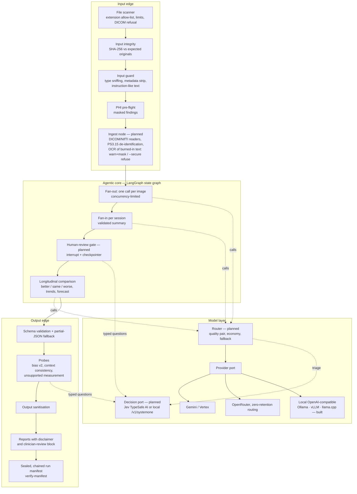

# Target architecture — the next version (v2)

**Status:** design, 2026-09-29. Parts marked **built** exist in the code today;
everything else is planned. This document consolidates `docs/ROADMAP.md` §2–§11,
[`LOCAL-INFERENCE.md`](LOCAL-INFERENCE.md), the SIME 2026 results
(`experiments/sime2026/RESULTS.md`) and the SIME-FULL follow-up
(`experiments/sime-full/`) into one picture. Research and education only; see
[`DISCLAIMER.md`](../../DISCLAIMER.md).

**Author:** Andrei N. Besleaga, Independent Researcher and Software Architect.

---

## 1. Design principles

1. **Constrain the generative component; make everything around it
   deterministic, verifiable and governed; then measure it honestly.** The model
   is the only non-deterministic part. Every input, call, output and decision
   around it is checked, recorded and reproducible.
2. **Evidence before claims.** No capability is described as working until a
   committed run shows it, and every published number is regenerated from the
   run records by a script.
3. **Guard both edges.** Inputs are checked before anything leaves the machine;
   outputs are validated, probed and cleaned before anyone reads them.
4. **Local first where the data demands it.** Data whose terms forbid third-party
   retention never leaves the machine.
5. **Change by decision record, not by drift.** The architecture evolves through
   measured comparisons and written decisions; the program never modifies itself.

## 2. The whole system

## 3. Components

| # | Component | State | What it does | Why (evidence) |
| --- | --- | --- | --- | --- |
| C1 | File scanner | built | Extension allow-list, `MAX_IMAGES_PER_RUN`, `MAX_IMAGE_BYTES`, DICOM refusal by extension and magic bytes | PHI hazard of DICOM tags and pixels |
| C2 | Input integrity | built | `--expect-hashes`: every image must match the SHA-256 of the expected original, or nothing is uploaded (exit 10) | Proves a run used the published dataset files unaltered |
| C3 | Input guard | built | Content-type sniffing against the extension; PNG/JPEG metadata detection and mandatory stripping; instruction-like text in context files; warn, or refuse under `--secure` (exit 9) | OWASP LLM01/LLM02; metadata could reach the provider on the pass-through path |
| C4 | PHI pre-flight | built | Identifier patterns in context text, masked excerpts, `--strict-phi` (exit 7) | HIPAA/GDPR minimisation |
| C5 | Ingest node | planned | DICOM/NIfTI readers, slice sampler, PS3.15 tag de-identification, OCR of every image: warn+mask by default, `--secure` refuses | Owner decision 2026-09-11 (1); prompt injection via text in images |
| C6 | Fan-out / fan-in / evolution graph | built | One call per image, per-session summary, cross-session comparison | SIME 2026 E2/E4 |
| C7 | Schema validation | built | Zod per stage; failures recorded; partial-JSON fallback | Runs never crash on a malformed answer (RESULTS §11) |
| C8 | Provider port + adapters | built (Gemini, OpenRouter, local) | Same prompts and parsers for every provider; model-aware image pre-flight; zero pricing for local models | ADR-004/006; PhysioNet 2025 policy requires no third-party retention |
| C9 | Router | planned | Quality-first pair in parallel, cross-checked, disagreement shown; `--economy`; fallback on 404/429/5xx; retirement detection | Owner decision (4); SIME 2026 showed answers depend on the model |
| C10 | Human-review gate | planned | Graph suspends before the longitudinal step until an attested approval | EU AI Act Art. 14; roadmap P2 |
| C11 | Decision port: Jev (TypeSafe AI) | planned | Typed, text-only questions answered with probabilities; never reads images or writes findings; every decision in the manifest | Second opinion for the probes' blind spots (held-out recall 0.565, implicit proxies 0/14) |
| C12 | Probes | built (v1, v2, context, measurement) | Bias v2 over ten attribute classes with negation; context consistency; absolute sizes without pixel spacing, high-confidence sizes first | SIME 2026 failure cases F1 and F2 |
| C13 | Output sanitisation | built | HTML escape, unsafe link removal, control-character removal before rendering | OWASP LLM05 |
| C14 | Reports | built | Disclaimer by type, clinician-review block first, treatment text labelled experimental | Art. 13/14 transparency |
| C15 | Run manifest + ledger | built | Every call, hash, cost, retry, warning and exit code, sealed and chained; offline `verify-manifest` | Art. 12; NIST MANAGE 4.1 |
| C16 | Signed manifests | planned | Ed25519 over the chain, local key; residual stated | Owner decision (2) |
| C17 | Profiles | partly built (`--secure`, `--strict-phi`, `--fail-on-probe`) | `research`, `physionet` (allow-list, zero-retention assertions, loopback-only local), `clinical-research` (no grounding, no treatment output) | PhysioNet policy; owner decision (7) |
| C18 | Evaluation harness | planned | Expert-label accuracy, group error rates with CIs, report metrics (RadGraph, GREEN, RaTEScore, CRIMSON), reader agreement (kappa, alpha, AC1) | Roadmap §4, §10 |
| C19 | Evolution harness | planned | Fixed criteria, candidates on development splits, one held-out evaluation, adoption by ADR | Principle 5 |
| C20 | Library, HTTP service, MCP | planned | Typed API; OpenAPI 3.1; auth, tenant isolation, cost cap per call, signed manifest per call; research-only intended purpose enforced | Owner request 2026-09-29 |
| C21 | Control register + evidence pack | planned | Machine-readable map: control → code → test → CI result; CI fails if a claimed control lacks a passing test | Verifiable compliance evidence without a certification claim |
| C22 | Bias governance | partly built (probe v2) | Group metrics, counterfactual note test, demographic-shortcut test, datasheets per dataset | STANDING Together; roadmap §10 |

## 4. Data routes

| Data | Allowed routes | Enforced by |
| --- | --- | --- |
| Public open data (NIH ChestX-ray14, TCIA CC BY sets) | any provider; OpenRouter with zero-retention routing preferred | none needed |
| PhysioNet credentialed data (MIMIC-CXR, MS-CXR-T, Chest ImaGenome, VinDr-CXR) | local models; enterprise cloud only with zero retention verified and recorded | `physionet` profile (planned): allow-list, loopback check, manifest record |
| Agreements forbidding third-party access (CheXpert, PadChest, ReXGradient) | local models only | same profile |
| Real patient images | not in scope; would need ethics approval, a legal basis, and on-device processing | out of scope by design |

## 5. Model tiers

| Tier | Models (verify on the day) | Use |
| --- | --- | --- |
| Local, 6 GB laptop | MedGemma 1.5 4B (built and tested; about 8 s per call warm) | zero-cost runs, PhysioNet data |
| Local, 24 GB workstation | MedGemma 27B, Gemma 4, Qwen3-VL | better local quality, if the hardware is bought |
| Cloud quality pair | current top Gemini and a second vendor | open data |
| Economy | a flash-lite class model | large batches, tests |
| Decision | Jev (TypeSafe AI) or local Nimble / Tev1 via Ollama `/v1/systemone` | probes, gate, router, harness |

## 6. Definition of done for the final paper and release

What "correct and verified" means here, stated so it can be checked:

1. **Every number is regenerated.** Each figure in the paper and in every
   `RESULTS.md` is produced by a committed script from committed run records; a
   test fails if a number drifts.
2. **Every input is proven original.** Runs use `--expect-hashes` against the
   dataset's published files.
3. **Every run is verifiable.** Each run has a sealed manifest that
   `verify-manifest` accepts, and the ledger links runs in order.
4. **Every claim has evidence or a stated limit.** Accuracy claims only against
   expert labels, with confidence intervals; everything else is stated as not
   shown.
5. **Every claimed control has a passing test** (control register, C21).
6. **Benchmarks are honest.** Probes are tuned on development sets and reported
   on held-out sets written before evaluation; blind spots are reported.
7. **Independent checks.** Adversarial reviews from clinical, statistical,
   engineering, security and legal lenses, and clinician review where volunteers
   are available; what was not reviewed is stated.

What cannot be promised, by anyone: that an AI system's diagnoses are correct
in every case. The programme guarantees that what is published is exactly what
was measured, how it was measured, and what it does not show.

## 7. Order of implementation

C8 local (built) → C2/C3/C12/C13 guardrails (built) → C5 ingest → C17 profiles →
C18 harness → C9 router → C10 gate → C16 signing → C22 bias governance → C11
decision port → C19 evolution harness → C20 library/service/MCP → C21 control
register → docs and datasheets. Each step keeps the test suite, coverage floors
and the demo green, and updates the docs in the same change.
